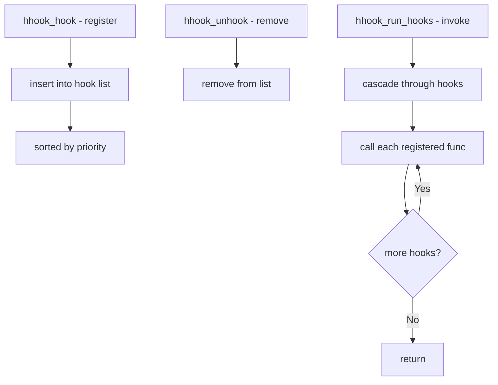

# Component: kern_hhook.c

**Path:** `sys/kern/kern_hhook.c`
**Type:** File
**Maps to:** `.discovery/sys/kern/kern_hhook.md`

## Purpose

Hierarchical hooks (hhook) - framework for kernel callback hooks. Allows subsystems to register callbacks that get invoked at specific kernel call sites. Used by DTrace, IPFW, and other subsystems.

## Structure



## Key Functions

| Function | Purpose | Signature |
|----------|---------|-----------|
| `hhook_hook` | Register hook | `int hhook_hook(int type, int id, ...)` |
| `hhook_unhook` | Unregister hook | `int hhook_unhook(int type, int id, ...)` |
| `hhook_run_hooks` | Invoke hooks | `void hhook_run_hooks(struct hhook_head *head, ...)` |
| `hhook_head_init` | Initialize head | `void hhook_head_init(struct hhook_head *head)` |

## Hook Head Structure

```c
struct hhook_head {
    struct hhook *hhk_head;   // First hook
    int hhk_type;             // Hook type
    // ...
};
```

## Hook Types

| Type | Description |
|------|-------------|
| `HHOOK_TYPE_NET` | Network hooks |
| `HHOOK_TYPE_SYS` | System hooks |

## Hook Sites

| Site | Description |
|------|-------------|
| `ipfw` | IP firewall |
| `dtrace` | DTrace probe |

## Hook Callback

```c
typedef int (*hhook_func_t)(void *data, void *udata);
```

## Hhook Usage

| Subsystem | Use |
|-----------|-----|
| `IPFW` | Packet hooks |
| `DTrace` | Probe hooks |
| `pf` | Packet filter |

## Includes

- `sys/hhook.h` - Hhook definitions
- `sys/khelp.h` - Kernel helpers

## Depends On

- `sys/khelp.h` for helper framework
- `sys/osd.h` for object-specific data