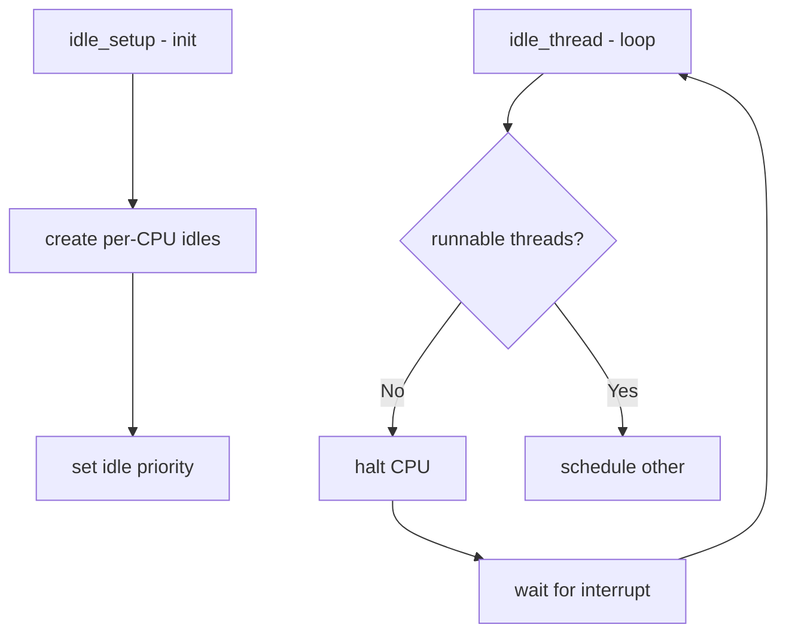

# Component: kern_idle.c

**Path:** `sys/kern/kern_idle.c`
**Type:** File
**Maps to:** `.discovery/sys/kern/kern_idle.md`

## Purpose

Idle thread management - creates and manages per-CPU idle threads. The idle thread runs when no other runnable threads exist on a CPU, entering low-power states.

## Structure



## Key Functions

| Function | Purpose | Signature |
|----------|---------|-----------|
| `idle_setup` | Initialize idle threads | `static void idle_setup(void *dummy)` |
| `idle_thread` | Main idle loop | `static void idle_thread(void *arg)` |
| `cpu_idle` | Enter idle state | `void cpu_idle(int wait)` |
| `cpu_idle_acpi` | ACPI idle | `void cpu_idle_acpi(int wait)` |

## Idle Process

| Property | Value |
|----------|-------|
| Priority | `PIDLE` |
| Scheduling | First CPU only |
| Stack | Small kernel stack |

## CPU Idle States

| State | Description |
|-------|-------------|
| `C0` | Active |
| `C1` | Halt |
| `C2` | Stopped clock |
| `C3` | Stopped clock + bus |

## Idle Loop

```c
while (sched_runnable() == 0)
    cpu_idle(CPU_IDLE_PRIORITY);
```

## ACPI Support

| Function | Description |
|----------|-------------|
| `cpu_idle_acpi` | Use ACPI C-states |
| `cpu_idle_c3` | Enter C3 state |

## Includes

- `sys/sched.h` - Scheduler
- `sys/kthread.h` - Kernel threads

## Depends On

- `kern_sched.c` for scheduling
- `machine/cpu.h` for MD idle