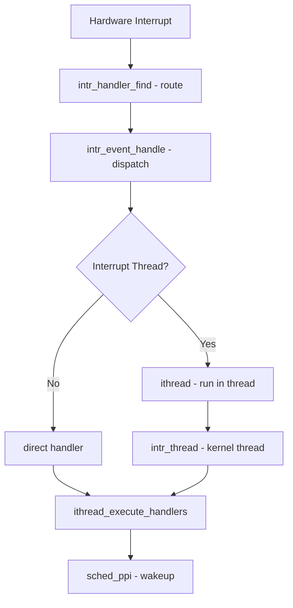

# Component: kern_intr.c

**Path:** `sys/kern/kern_intr.c`
**Type:** File
**Maps to:** `.discovery/sys/kern/kern_intr.md`

## Purpose

Interrupt handling framework - manages hardware interrupt threads, interrupt event routing, and storm detection. Implements threaded interrupt model where handlers run in kernel threads rather than direct context.

## Structure

## Key Functions

| Function | Purpose | Signature |
|----------|---------|-----------|
| `intr_event_handle` | Handle interrupt event | `int intr_event_handle(struct intr_event *ev, struct trapframe *tf)` |
| `ithread_handler` | Interrupt thread main loop | `static void ithread_handler(void *arg)` |
| `intr_irq_alloc` | Allocate interrupt handle | `int intr_irq_alloc(...)` |
| `intr_irq_free` | Free interrupt handle | `void intr_irq_free(struct intr_irq_handle *irq)` |
| `intr_event_create` | Create interrupt event | `int intr_event_create(...)` |
| `intr_event_destroy` | Destroy interrupt event | `int intr_event_destroy(struct intr_event *ev)` |
| `intr_irq_bind` | Bind interrupt to CPU | `int intr_irq_bind(struct intr_irq_handle *irq, int cpu)` |
| `intr_event_add_handler` | Add handler to event | `int intr_event_add_handler(...)` |

## Data Structures

| Structure | Purpose |
|-----------|---------|
| `struct intr_thread` | Per-interrupt-event thread state |
| `struct intr_event` | Interrupt event descriptor |
| `struct intr_handler` | Individual interrupt handler |
| `struct intr_irq_handle` | IRQ allocation handle |

## Interrupt Thread Model

- Interrupt threads (ithreads) run in kernel context but not direct interrupt context
- Reduces interrupt latency by deferring work
- Per-CPU interrupt threads for parallel handling
- Priority levels via `TDF_NEEDCPU` scheduling

## Includes

- `sys/interrupt.h` - Interrupt subsystem definitions
- `sys/proc.h` - Process/thread structures
- `machine/atomic.h` - Atomic operations
- `machine/cpu.h` - CPU-specific code

## Depends On

- Device drivers register handlers via this framework
- `sys/kthread.c` for creating kernel threads
- `sys/sched.c` for scheduling interrupt threads