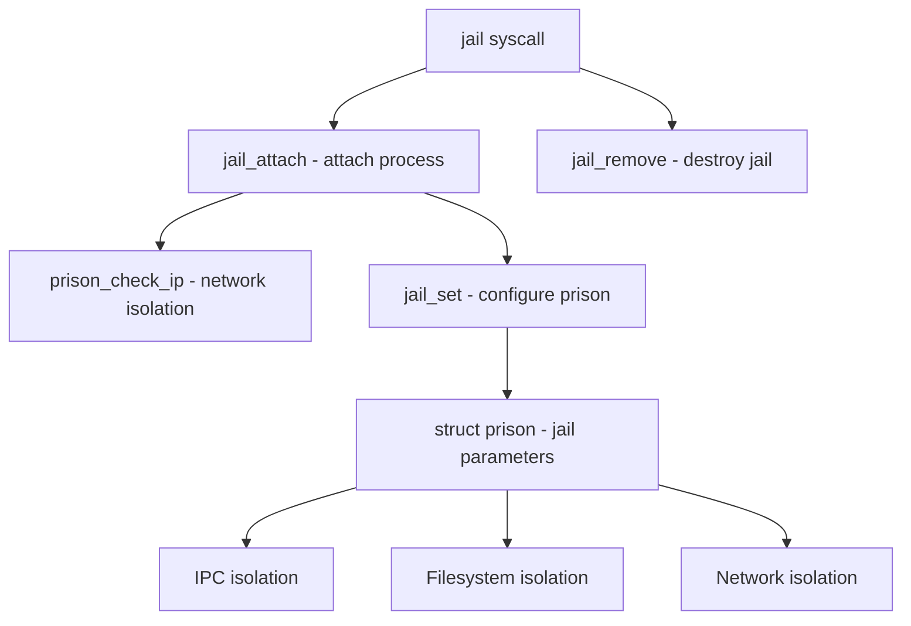

# Component: kern_jail.c

**Path:** `sys/kern/kern_jail.c`
**Type:** File
**Maps to:** `.discovery/sys/kern/kern_jail.md`

## Purpose

FreeBSD jail subsystem - implements OS-level virtualization (containers). Provides process isolation, resource limits, and namespace separation for running services in isolated environments.

## Structure

## Key Functions

| Function | Purpose | Signature |
|----------|---------|-----------|
| `sys_jail` | Create/destroy jail | `int sys_jail(struct thread *td, struct jail_args *uap)` |
| `sys_jail_attach` | Attach process to jail | `int jail_attach(struct thread *td, struct jail_attach_args *uap)` |
| `jail_set` | Configure jail parameters | `int jail_set(struct thread *td, struct uio *uio)` |
| `jail_get` | Get jail parameters | `int jail_get(struct thread *td, struct uio *uio)` |
| `jail_remove` | Remove jail | `int jail_remove(struct proc *p)` |
| `jail_check_ip` | Check IP access | `int prison_check_ip(struct prison *pr, struct in_addr *ia)` |
| `jail_proc_check` | Check proc access | `int prison_proc_check(struct thread *td, int op)` |
| `jail_cred` | Get process jail | `struct prison *jail_cred(struct thread *td)` |

## Data Structures

| Structure | Purpose |
|-----------|---------|
| `struct prison` | Jail/Prison descriptor |
| `M_PRISON` | MALLOC zone for prison structures |
| `M_PRISON_RACCT` | Resource limits for jail |

## Jail Parameters

| Parameter | Description |
|-----------|-------------|
| `name` | Jail name |
| `host.hostname` | Jail hostname |
| `host.domainname` | Jail domainname |
| `path` | Root filesystem path |
| `ip.*` | IP address restrictions |
| `children.max` | Max child jails |
| `enforce_statfs` | Filesystem view restrictions |
| `securelevel` | Secure level for jail |

## Includes

- `sys/jail.h` - Jail definitions
- `sys/jaildesc.h` - Jail descriptors
- `sys/rctl.h` - Resource limits
- `net/if.h` - Network interface

## Depends On

- Used by all system calls requiring jail checks
- `netinet/in.c` for IP isolation
- `vfs_syscalls.c` for filesystem isolation
- `sys_pipe.c` for IPC isolation