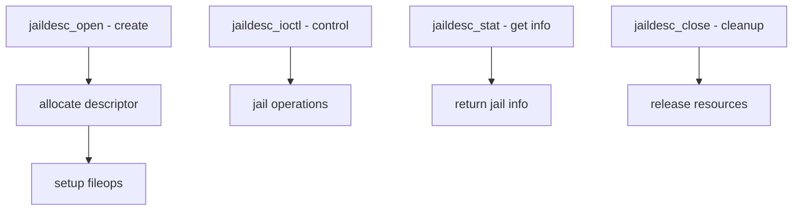

# Component: kern_jaildesc.c

**Path:** `sys/kern/kern_jaildesc.c`
**Type:** File
**Maps to:** `.discovery/sys/kern/kern_jaildesc.md`

## Purpose

Jail descriptors - provides descriptor-based interface for jail operations. Creates file-like descriptor objects representing jails for IPC and management.

## Structure

## Key Functions

| Function | Purpose | Signature |
|----------|---------|-----------|
| `jaildesc_open` | Open jail descriptor | `int jaildesc_open(struct file *fp, ...)` |
| `jaildesc_ioctl` | Control jail | `int jaildesc_ioctl(struct file *fp, ...)` |
| `jaildesc_stat` | Get jail info | `int jaildesc_stat(struct file *fp, ...)` |
| `jaildesc_close` | Close descriptor | `int jaildesc_close(struct file *fp)` |
| `jaildesc_fill_kinfo` | Fill kinfo | `int jaildesc_fill_kinfo(...)` |

## Jail Descriptor Ops

| Operation | Function |
|-----------|----------|
| `fo_read` | invfo_rdwr (no read) |
| `fo_write` | invfo_rdwr (no write) |
| `fo_ioctl` | jaildesc_ioctl |
| `fo_poll` | jaildesc_poll |
| `fo_close` | jaildesc_close |

## Jail Descriptor Use

| Use | Description |
|-----|-------------|
| `JAIL_ATTACH` | Attach to jail |
| `JAIL_SET` | Modify jail |
| `JAIL_GET` | Query jail |

## Includes

- `sys/jaildesc.h` - Jail descriptor definitions

## Depends On

- `kern_jail.c` for jail operations
- `sys/file.h` for file operations