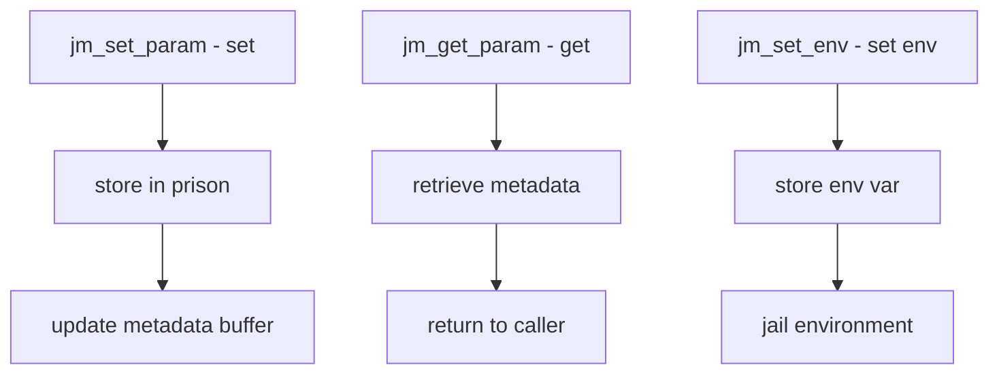

# Component: kern_jailmeta.c

**Path:** `sys/kern/kern_jailmeta.c`
**Type:** File
**Maps to:** `.discovery/sys/kern/kern_jailmeta.md`

## Purpose

Jail metadata - provides mechanisms for attaching and managing key-value metadata to jails. Allows storing arbitrary metadata strings associated with jail parameters and environment.

## Structure



## Key Functions

| Function | Purpose | Signature |
|----------|---------|-----------|
| `jm_set_param` | Set metadata param | `int jm_set_param(struct prison *pr, ...)` |
| `jm_get_param` | Get metadata param | `int jm_get_param(struct prison *pr, ...)` |
| `jm_set_env` | Set environment | `int jm_set_env(struct prison *pr, ...)` |
| `jm_maxbufsize` | Get/set buffer size | `int jm_sysctl_meta_maxbufsize(...)` |

## Jail Metadata Types

| Type | Description |
|------|-------------|
| `param` | Jail parameters |
| `env` | Environment variables |

## Metadata Buffer

| Limit | Description |
|-------|-------------|
| `jm_maxbufsize_hard` | Hard limit |
| `jm_maxbufsize_soft` | Soft limit |

## Sysctl

| Node | Description |
|------|-------------|
| `security.jail.param.meta` | Meta parameters |
| `security.jail.param.env` | Environment |

## Metadata Format

```
key=value
```

## Includes

- `sys/jail.h` - Jail definitions
- `sys/osd.h` - Object-specific data

## Depends On

- `kern_jail.c` for jail infrastructure
- `sys/sysctl.h` for sysctl interface