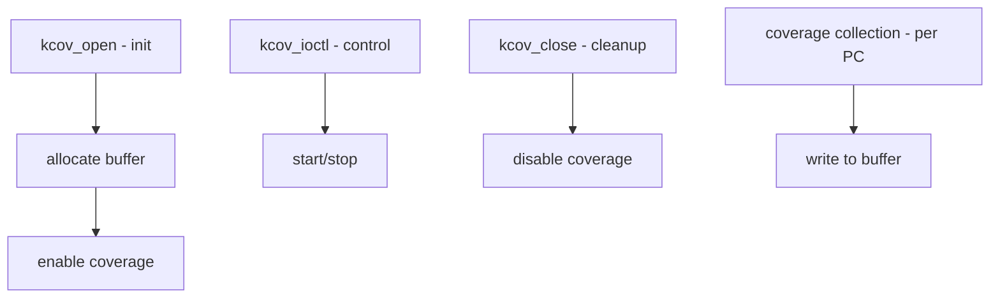

# Component: kern_kcov.c

**Path:** `sys/kern/kern_kcov.c`
**Type:** File
**Maps to:** `.discovery/sys/kern/kern_kcov.md`

## Purpose

Kernel coverage collection (KCOV) - provides kernel-side support for coverage-guided fuzzing. Collects code coverage data during kernel execution for testing and bug finding.

## Structure



## Key Functions

| Function | Purpose | Signature |
|----------|---------|-----------|
| `kcov_open` | Open kcov device | `int kcov_open(struct file *fp)` |
| `kcov_close` | Close device | `int kcov_close(struct file *fp)` |
| `kcov_ioctl` | Control kcov | `int kcov_ioctl(struct file *fp, u_long cmd, ...)` |
| `kcov_add_pc` | Add PC | `void kcov_add_pc(uint32_t *buf, uintptr_t pc)` |

## KCOV Modes

| Mode | Description |
|------|-------------|
| `KCOV_MODE_CMP` | Comparison tracking |
| `KCOV_MODE_TRACE_PC` | PC tracking |

## KCOV Ioctls

| Ioctl | Description |
|-------|-------------|
| `KCOV_IOC_ENABLE` | Enable coverage |
| `KCOV_IOC_DISABLE` | Disable coverage |
| `KCOV_IOC_RESET` | Reset buffer |

## Coverage Buffer

```c
struct kcov_info {
    uint32_t *kcb_buf;     // Coverage buffer
    size_t kcb_bufsize;     // Buffer size
    int kcb_mode;           // Mode
};
```

## Fuzzing Integration

| Use | Description |
|-----|-------------|
| `AFL` | American Fuzzy Lop |
| `libFuzzer` | Coverage-guided fuzzer |

## SAN Support

| SAN | Description |
|-----|-------------|
| `KASAN` | Kernel Address Sanitizer |
| `KCSAN` | Kernel Concurrency Sanitizer |

## Includes

- `sys/kcov.h` - KCOV definitions

## Depends On

- `vm/vm_map.h` for memory mapping
- `sys/mman.h` for mmap