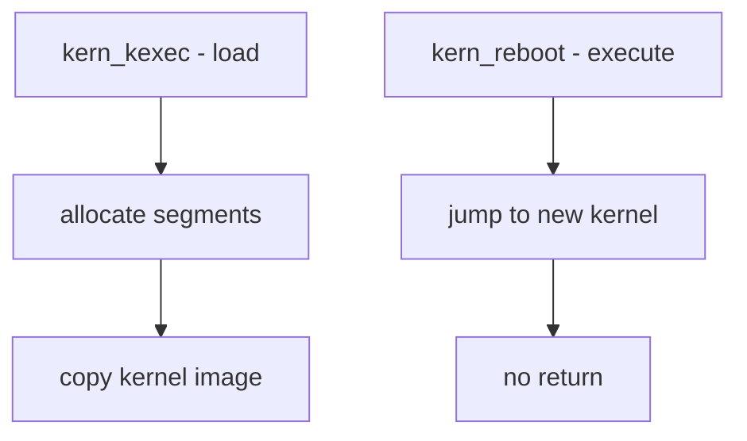

# Component: kern_kexec.c

**Path:** `sys/kern/kern_kexec.c`
**Type:** File
**Maps to:** `.discovery/sys/kern/kern_kexec.md`

## Purpose

Kernel kexec - supports loading and executing a new kernel without rebooting hardware. Allows fast kernel switching for high-availability systems and kernel development.

## Structure



## Key Functions

| Function | Purpose | Signature |
|----------|---------|-----------|
| `kern_kexec` | Load kernel | `int kern_kexec(struct thread *td, ...)` |
| `kern_kexec_alloc` | Allocate segments | `int kern_kexec_alloc(...)` |
| `kern_kexec_free` | Free segments | `void kern_kexec_free(void)` |
| `machine_kexec` | MD transition | `void machine_kexec(...)` |

## Kexec Syscalls

| Call | Description |
|------|-------------|
| `sys_kexec` | Load kernel image |
| `sys_reboot` | Reboot (with kexec flag) |

## Kexec Segments

```c
struct kexec_segment {
    void *buf;           // Buffer address
    size_t bufsize;      // Buffer size
    const char *type;    // Segment type
};
```

## Segment Types

| Type | Description |
|------|-------------|
| `text` | Kernel text |
| `data` | Kernel data |
| `bootblock` | Boot loader |

## Kexec Flags

| Flag | Description |
|------|-------------|
| `KEXEC_PRESERVE_CONTEXT` | Preserve current kernel |

## Machine-Dependent

| Function | Description |
|----------|-------------|
| `machine_kexec` | MD kexec implementation |
| `machine_shutdown` | MD shutdown |

## Includes

- `sys/kexec.h` - Kexec definitions
- `machine/kexec.h` - MD kexec

## Depends On

- `vm/vm_kern.h` for kernel VM
- `machine/kexec.h` for MD parts