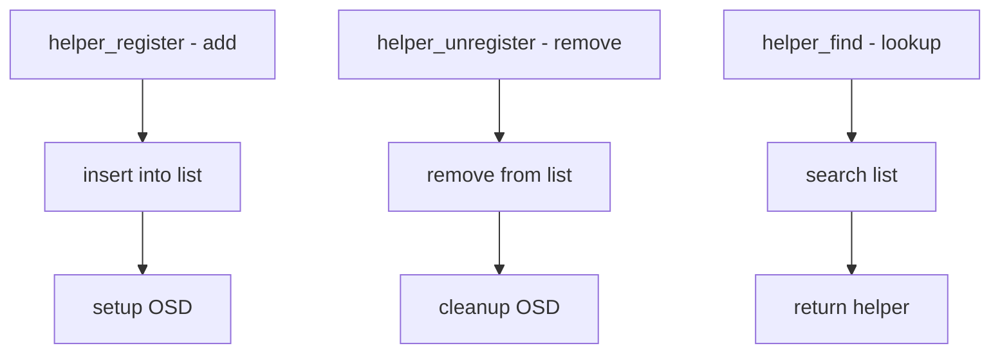

# Component: kern_khelp.c

**Path:** `sys/kern/kern_khelp.c`
**Type:** File
**Maps to:** `.discovery/sys/kern/kern_khelp.md`

## Purpose

Kernel helpers framework - provides infrastructure for registering helper modules that can hook into kernel operations. Used by hhook system and IPFW/IPsec helpers.

## Structure



## Key Functions

| Function | Purpose | Signature |
|----------|---------|-----------|
| `helper_register` | Register helper | `int helper_register(struct helper *hp)` |
| `helper_unregister` | Unregister | `int helper_unregister(const char *name)` |
| `helper_find` | Find helper | `struct helper *helper_find(const char *name)` |
| `helper_get_osd` | Get OSD | `struct osd *helper_get_osd(struct helper *hp)` |

## Helper Structure

```c
struct helper {
    const char *h_name;       // Name
    TAILQ_ENTRY(helper) h_next;  // List entry
    struct osd h_osd;         // Object-specific data
    int h_refcount;           // Reference count
};
```

## Helper Uses

| Subsystem | Use |
|-----------|-----|
| `IPFW` | Packet processing helpers |
| `IPsec` | Security policy helpers |
| `DTrace` | Probe helpers |

## OSD Integration

| Component | Description |
|-----------|-------------|
| `osd` | Object-specific data |
| `osd_method` | OSD method handlers |

## Hook Integration

| Hook | Description |
|------|-------------|
| `hhook` | Hierarchical hooks |
| `helper` | Helper framework |

## Includes

- `sys/khelp.h` - Kernel helpers
- `sys/hhook.h` - Hierarchical hooks

## Depends On

- `sys/osd.h` for object-specific data
- `sys/hhook.h` for hooks