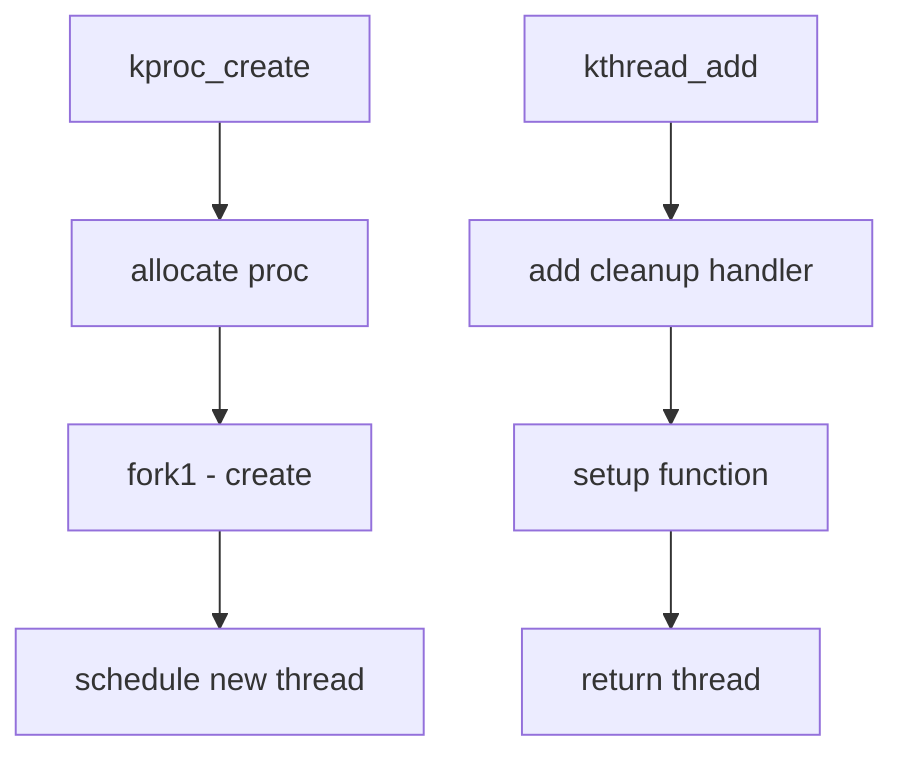

# Component: kern_kthread.c

**Path:** `sys/kern/kern_kthread.c`
**Type:** File
**Maps to:** `.discovery/sys/kern/kern_kthread.md`

## Purpose

Kernel thread management - creates and manages kernel threads (kthreads). Used for background daemon processes like the pageout daemon, swapper, and idle threads.

## Structure



## Key Functions

| Function | Purpose | Signature |
|----------|---------|-----------|
| `kproc_create` | Create kthread | `int kproc_create(void (*func)(void *), void *arg, struct proc **pp, int flags, int pprio, const char *fmt, ...)` |
| `kproc_exit` | Exit kthread | `void kproc_exit(void *arg, int ecode)` |
| `kthread_add` | Add kthread | `int kthread_add(void (*func)(void *), void *arg, struct proc *pproc, struct thread **td, int flags, int prio, const char *fmt, ...)` |
| `kthread_resume` | Resume kthread | `int kthread_resume(struct proc *p)` |
| `kthread_suspend` | Suspend kthread | `int kthread_suspend(struct proc *p, int timo)` |
| `kthread_stop` | Stop kthread | `int kthread_stop(struct proc *p)` |

## Kernel Daemons

| Daemon | Purpose |
|--------|---------|
| `pageout` | Pageout daemon |
| `swapper` | Memory swapper |
| `syncer` | Filesystem sync |
| `idle` | Idle thread |
| `intr` | Interrupt thread |

## kproc_desc Structure

```c
struct kproc_desc {
    const char *arg0;        // Name
    void (*func)(void *);   // Main function
    void *arg;               // Argument
    struct proc **proc;      // Result proc
};
```

## Includes

- `sys/kthread.h` - Kernel thread definitions
- `sys/proc.h` - Process structures
- `sys/sched.h` - Scheduler

## Depends On

- `kern_fork.c` for process creation
- `kern_synch.c` for sleep/wakeup