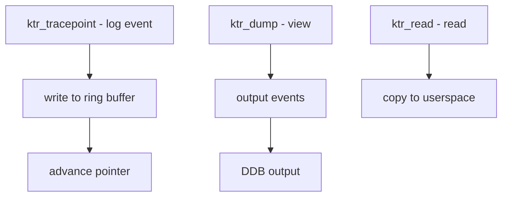

# Component: kern_ktr.c

**Path:** `sys/kern/kern_ktr.c`
**Type:** File
**Maps to:** `.discovery/sys/kern/kern_ktr.md`

## Purpose

Kernel trace (KTR) - provides a mechanism for recording kernel trace events. Events can be viewed in DDB or dumped for analysis. Used for debugging and performance analysis.

## Structure



## Key Functions

| Function | Purpose | Signature |
|----------|---------|-----------|
| `ktr_tracepoint` | Log event | `void ktr_tracepoint(int mask, ...)` |
| `ktr_init` | Initialize | `void ktr_init(void)` |
| `ktr_dump` | Dump events | `void ktr_dump(void)` |
| `ktr_read` | Read events | `int ktr_read(char *buf, ...)` |

## KTR Mask

| Mask | Description |
|------|-------------|
| `KTR_ALL` | All events |
| `KTR_ENTRY` | Function entry |
| `KTR_EXIT` | Function exit |
| `KTR_INT` | Interrupt |
| `KTR_LOCK` | Lock events |
| `KTR_WATCH` | Watch events |

## KTR Event Structure

```c
struct ktr_entry {
    struct timeval ktr_time;   // Timestamp
    int ktr_type;              // Event type
    caddr_t ktr_pc;            // PC
    struct thread *ktr_td;     // Thread
    size_t ktr_len;           // Data length
    char ktr_data[0];         // Event data
};
```

## KTR Classes

| Class | Description |
|-------|-------------|
| `KTR_CLASS` | Event class |
| `KTR_SUBCLASS` | Subclass |

## Sysctl

| Node | Description |
|------|-------------|
| `debug.ktr` | KTR settings |

## Includes

- `sys/ktr.h` - KTR definitions
- `sys/alq.h` - ALQ logging

## Depends On

- `sys/cons.h` for console output
- `sys/lock.h` for locking