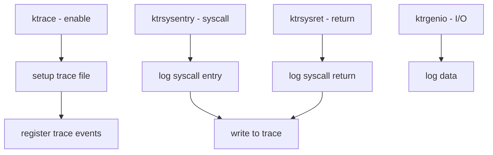

# Component: kern_ktrace.c

**Path:** `sys/kern/kern_ktrace.c`
**Type:** File
**Maps to:** `.discovery/sys/kern/kern_ktrace.md`

## Purpose

Kernel process tracing (ktrace) - provides per-process tracing of system calls, signal delivery, and other kernel events. Traces are written to a file for later analysis.

## Structure



## Key Functions

| Function | Purpose | Signature |
|----------|---------|-----------|
| `ktrace` | Enable tracing | `int ktrace(struct thread *td, ...)` |
| `ktrsysentry` | Syscall entry | `void ktrsysentry(int sysnum)` |
| `ktrsysret` | Syscall return | `void ktrsysret(int sysnum, int error)` |
| `ktrgenio` | General I/O | `void ktrgenio(int fd, ...)` |
| `ktsignal` | Signal event | `void ktsignal(struct thread *td, int sig)` |

## Trace Events

| Event | Description |
|-------|-------------|
| `KTR_SYSCALL` | Syscall entry/return |
| `KTR_SYSRET` | Syscall return |
| `KTR_SIGNAL` | Signal delivery |
| `KTR_GENIO` | I/O data |
| `KTR_NAMEI` | Path lookup |
| `KTR_PSIG` | Posted signal |

## Ktrace Operations

| Op | Description |
|----|-------------|
| `KTROP_SET` | Enable tracing |
| `KTROP_CLEAR` | Disable tracing |
| `KTROP_FAULT` | Trace faults |
| `KTROP_SYSFLAGS` | Syscall flags |

## Trace Point Structure

```c
struct ktr_header {
    struct timeval ktr_time;   // Timestamp
    pid_t ktr_pid;            // Process ID
    caddr_t ktr_pc;           // PC
    int ktr_code;             // Event code
    size_t ktr_len;           // Data length
};
```

## Sysctl

| Node | Description |
|------|-------------|
| `kern.ktrace_on` | Ktrace enable |

## Includes

- `sys/ktrace.h` - Ktrace definitions

## Depends On

- `sys/vnode.h` for trace file
- `sys/sysent.h` for syscalls