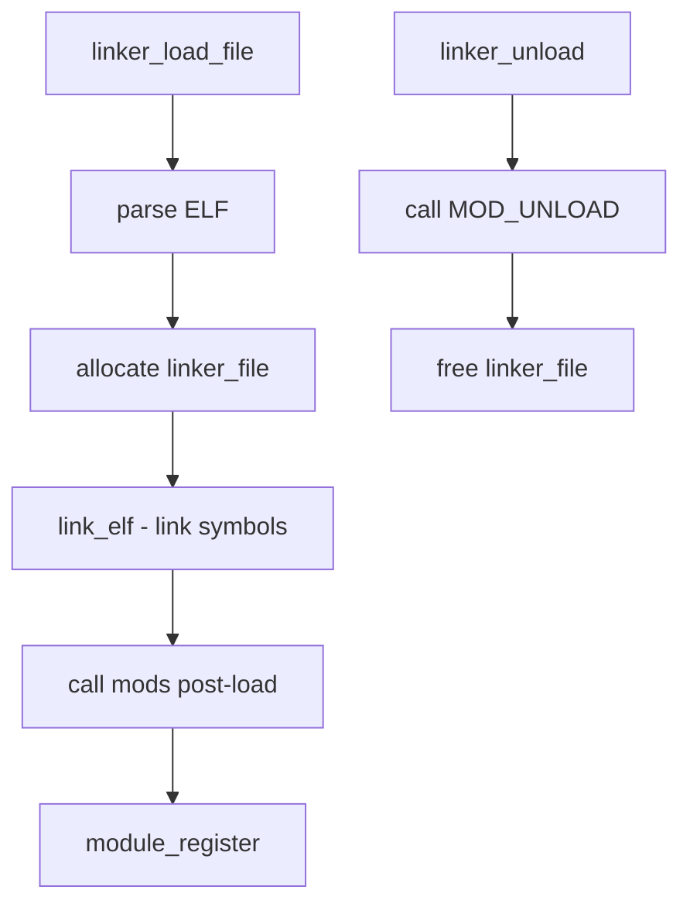

# Component: kern_linker.c

**Path:** `sys/kern/kern_linker.c`
**Type:** File
**Maps to:** `.discovery/sys/kern/kern_linker.md`

## Purpose

Kernel linker - loads ELF kernel modules (kld). Handles kernel module loading, symbol resolution, dependency ordering, and module initialization via the linker_file infrastructure.

## Structure



## Key Functions

| Function | Purpose | Signature |
|----------|---------|-----------|
| `linker_load_file` | Load ELF file | `int linker_load_file(const char *filename, linker_file_t *result)` |
| `linker_load_elf` | Load ELF format | `int linker_load_elf(linker_file_t file)` |
| `linker_link_elf` | Link symbols | `int linker_link_elf(linker_file_t file)` |
| `linker_unload` | Unload module | `int linker_unload(linker_file_t file)` |
| `linker_search` | Find symbol | `caddr_t linker_search(const char *symname)` |
| `linker_file_lookup` | Lookup in file | `caddr_t linker_file_lookup(linker_file_t file, const char *symname)` |
| `linker_add_dependency` | Add dependency | `int linker_add_dependency(linker_file_t file, linker_file_t dep, int flags)` |
| `mod_load` | Load module by name | `int mod_load(const char *modname)` |
| `mod_unload` | Unload module | `int mod_unload(const char *modname)` |

## Linker File Structure

```c
struct linker_file {
    TAILQ_ENTRY(linker_file) link;     // All files
    TAILQ_HEAD(, module) modules;       // Modules in file
    int id;                             // Unique ID
    const char *filename;               // File name
    caddr_t address;                    // Load address
    // ... more fields
};
```

## Dependency Handling

| Function | Purpose |
|----------|---------|
| `PRELOAD` | Preloaded modules |
| `MODLOAD` | Dynamic loading |
| `MODUNLOAD` | Dynamic unloading |

## Includes

- `sys/linker.h` - Linker definitions
- `sys/module.h` - Module definitions
- `sys/elf.h` - ELF format

## Depends On

- `kern_module.c` for module registration
- `kern_kld.c` for kld syscalls
- `exec.elf` for ELF handling