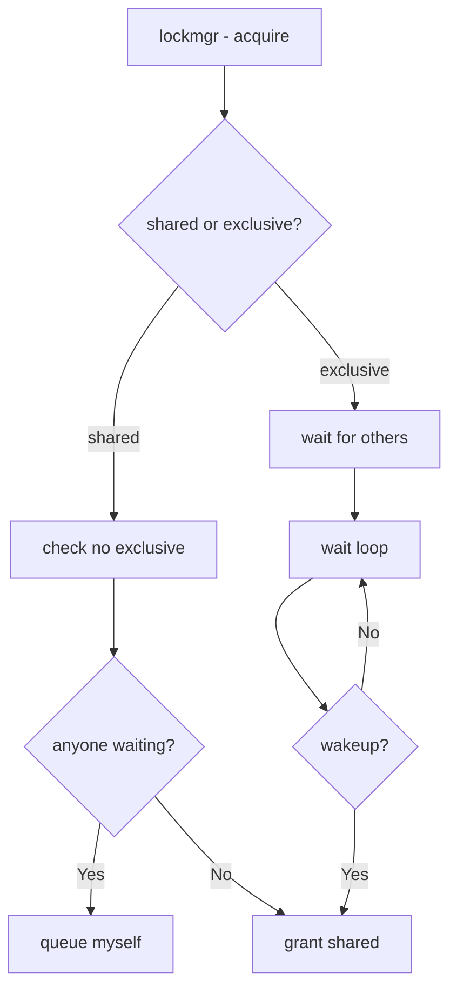

# Component: kern_lock.c

**Path:** `sys/kern/kern_lock.c`
**Type:** File
**Maps to:** `.discovery/sys/kern/kern_lock.md`

## Purpose

Generic lock manager - implements lockmgr locks for file and resource locking. Provides shared/exclusive locking with optional wait queues.

## Structure



## Key Functions

| Function | Purpose | Signature |
|----------|---------|-----------|
| `lockmgr` | Acquire lock | `int lockmgr(struct lockmgr *lk, u_int flags, ...)` |
| `lockmgr_assert` | Assert lock state | `void lockmgr_assert(...)` |
| `lockinit` | Initialize lock | `void lockinit(struct lockmgr *lk, ...)` |
| `lockdestroy` | Destroy lock | `void lockdestroy(struct lockmgr *lk)` |

## Lock Flags

| Flag | Description |
|------|-------------|
| `LK_EXCLUSIVE` | Exclusive (write) |
| `LK_SHARED` | Shared (read) |
| `LK_NOWAIT` | Non-blocking |
| `LK_RETRY` | Retry on wait |
| `LK_INTERLOCK` | Interlock held |

## Lock States

| State | Description |
|-------|-------------|
| `LK_EXCLUSIVE` | One writer |
| `LK_SHARED` | Multiple readers |

## lockmgr Structure

```c
struct lockmgr {
    u_int lm_lock;        // Lock word
    struct thread *lm_owner;  // Owner (exclusive)
    TAILQ_HEAD(, lock_list) lm_wait;  // Waiters
    const char *lm_file;  // File
    int lm_line;          // Line
};
```

## Uses

| Use | Description |
|-----|-------------|
| `vn_lock` | Vnode locking |
| `VFS` | Filesystem locks |

## Includes

- `sys/lockmgr.h` - Lock manager

## Depends On

- `sys/sleepqueue.h` for sleeping
- `sys/mutex.h` for base mutex