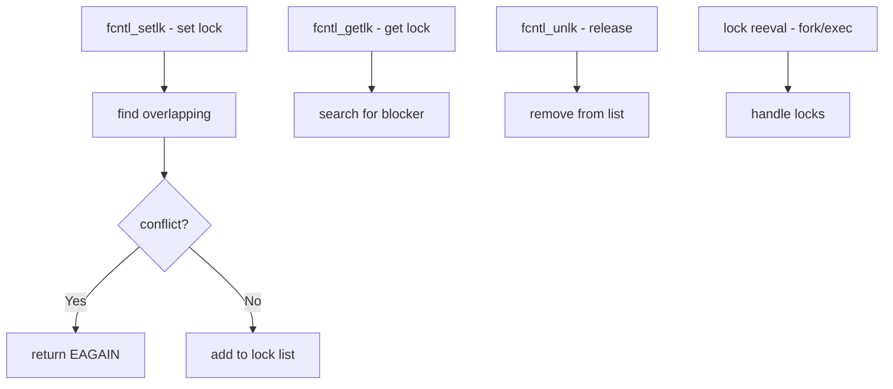

# Component: kern_lockf.c

**Path:** `sys/kern/kern_lockf.c`
**Type:** File
**Maps to:** `.discovery/sys/kern/kern_lockf.md`

## Purpose

File record locking (fcntl) - implements POSIX advisory file locks via fcntl F_SETLK/F_GETLK. Manages byte-range locks on files for inter-process synchronization.

## Structure



## Key Functions

| Function | Purpose | Signature |
|----------|---------|-----------|
| `fcntl_setlk` | Set lock | `int fcntl_setlk(struct thread *td, ...)` |
| `fcntl_getlk` | Get lock info | `int fcntl_getlk(struct thread *td, ...)` |
| `fcntl_unlk` | Release lock | `int fcntl_unlk(struct thread *td, ...)` |
| `lf_setlock` | Internal set | `static int lf_setlock(struct lockf *lf)` |
| `lf_clearlock` | Internal clear | `static int lf_clearlock(struct lockf *lf)` |

## Lock Types

| Type | Description |
|------|-------------|
| `F_RDLCK` | Shared read lock |
| `F_WRLCK` | Exclusive write lock |
| `F_UNLCK` | Unlock |

## Lockf Structure

```c
struct lockf {
    struct lockf *l_next;      // Hash chain
    struct lockf **l_prev;
    struct proc *l_proc;       // Owner process
    caddr_t l_fname;           // Filename
    off_t l_start;             // Start offset
    off_t l_end;               // End offset
    short l_type;              // Lock type
    short l_syslock;           // System lock flag
};
```

## Lock Ranges

| Start | End | Description |
|-------|-----|-------------|
| `0` | `0` | Lock entire file |
| `0` | `EOF` | Lock to end-of-file |
| `N` | `M` | Lock byte range |

## Advisory Locking

| Property | Description |
|----------|-------------|
| Advisory | Other processes can ignore |
| Non-blocking | F_SETLK returns immediately |
| Automatic | Released on close |

## Includes

- `sys/lockf.h` - Lockf definitions

## Depends On

- `vfs_vnops.c` for vnode locks
- `sys/file.h` for file operations