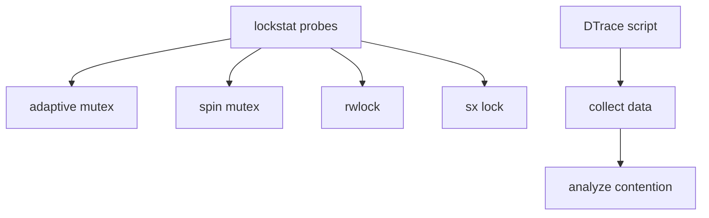

# Component: kern_lockstat.c

**Path:** `sys/kern/kern_lockstat.c`
**Type:** File
**Maps to:** `.discovery/sys/kern/kern_lockstat.md`

## Purpose

Lock statistics via DTrace - provides DTrace probe points for lock performance analysis. Allows measuring lock contention, acquisition time, and blocking behavior.

## Structure



## DTrace Probes

| Probe | Description |
|-------|-------------|
| `adaptive::acquire` | Mutex acquire |
| `adaptive::release` | Mutex release |
| `adaptive::spin` | Spin while waiting |
| `adaptive::block` | Block on mutex |
| `spin::acquire` | Spin acquire |
| `spin::spin` | Spin spin |
| `rw::acquire` | Read-write acquire |
| `rw::block` | Read-write block |
| `sx::acquire` | Sx acquire |

## Lock Types

| Type | Description |
|------|-------------|
| `adaptive` | Adaptive mutex |
| `spin` | Spin mutex |
| `rw` | Read-write lock |
| `sx` | Shared/exclusive |

## Metrics Collected

| Metric | Description |
|--------|-------------|
| `acquire_count` | Number of acquisitions |
| `spin_time` | Time spent spinning |
| `block_time` | Time spent blocked |

## SDT Provider

```c
SDT_PROVIDER_DEFINE(lockstat);
```

## Usage

```dtrace
lockstat -a -A mutex
```

## Includes

- `sys/lockstat.h` - Lockstat definitions
- `sys/sdt.h` - DTrace SDT

## Depends On

- `sys/lock.h` for lock interfaces
- `sys/mutex.h` for mutexes