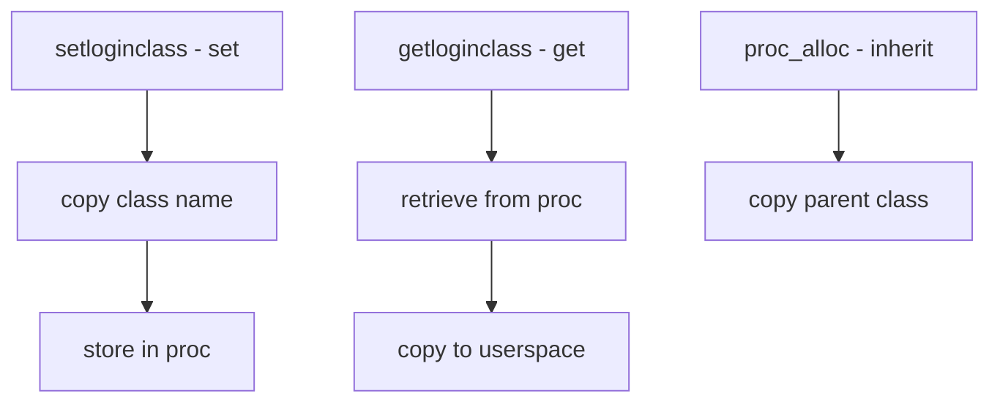

# Component: kern_loginclass.c

**Path:** `sys/kern/kern_loginclass.c`
**Type:** File
**Maps to:** `.discovery/sys/kern/kern_loginclass.md`

## Purpose

Login class management - implements setloginclass(2) and getloginclass(2) syscalls. Stores login class name for processes, used for per-class resource limits.

## Structure



## Key Functions

| Function | Purpose | Signature |
|----------|---------|-----------|
| `sys_setloginclass` | Set login class | `int sys_setloginclass(struct thread *td, ...)` |
| `sys_getloginclass` | Get login class | `int sys_getloginclass(struct thread *td, ...)` |
| `loginclass_hold` | Hold reference | `void loginclass_hold(struct loginclass *lc)` |
| `loginclass_rele` | Release reference | `void loginclass_rele(struct loginclass *lc)` |

## Login Class

```c
struct loginclass {
    char lc_name[MAXLOGNAME];  // Class name
    int lc_refcount;          // Reference count
    struct rctl *lc_rctl;     // Resource limits
    // ...
};
```

## Login Class Names

| Class | Description |
|-------|-------------|
| `default` | Default class |
| `root` | Root class |
| `daemon` | Daemon class |

## Uses

| Use | Description |
|-----|-------------|
| `login(1)` | Sets class on login |
| `setusercontext()` | Applies user settings |
| `rctl` | Resource limits |

## Syscall Arguments

| Syscall | Args |
|---------|------|
| `setloginclass` | name |
| `getloginclass` | name (out) |

## Includes

- `sys/loginclass.h` - Login class definitions

## Depends On

- `sys/proc.h` for process
- `sys/rctl.h` for resource limits