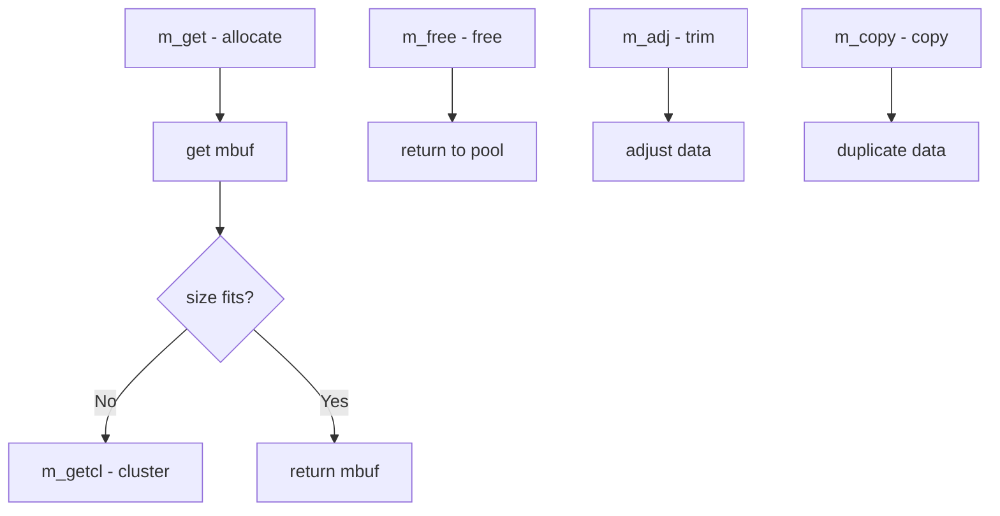

# Component: kern_mbuf.c

**Path:** `sys/kern/kern_mbuf.c`
**Type:** File
**Maps to:** `.discovery/sys/kern/kern_mbuf.md`

## Purpose

Mbuf management - manages network packet buffers (mbufs). Provides allocation, freeing, and manipulation of mbuf clusters for network I/O.

## Structure



## Key Functions

| Function | Purpose | Signature |
|----------|---------|-----------|
| `m_get` | Get mbuf | `struct mbuf *m_get(int how, int type)` |
| `m_getcl` | Get cluster | `struct mbuf *m_getcl(int how, int type, int flags)` |
| `m_free` | Free mbuf | `struct mbuf *m_free(struct mbuf *m)` |
| `m_adj` | Adjust mbuf | `void m_adj(struct mbuf *mp, int req_len)` |
| `m_copy` | Copy mbuf | `struct mbuf *m_copy(struct mbuf *m, int off, int len)` |
| `m_freem` | Free all | `void m_freem(struct mbuf *m)` |

## Mbuf Types

| Type | Description |
|------|-------------|
| `MT_DATA` | Normal data |
| `MT_HEADER` | Packet header |
| `MT_SONAME` | Socket name |
| `MT_CONTROL` | Ancillary data |
| `MT_OOBDATA` | Out-of-band |

## Mbuf Flags

| Flag | Description |
|------|-------------|
| `M_PKTHDR` | Packet header |
| `M_EOR` | End of record |
| `M_BCAST` | Broadcast |
| `M_MCAST` | Multicast |

## Cluster Sizes

| Size | Description |
|------|-------------|
| `MCLBYTES` | 2KB cluster |
| `MCLBYTES` | Jumbo cluster (9KB) |

## Mbuf Structure

```c
struct mbuf {
    struct mbuf *m_next;     // Next in chain
    struct mbuf *m_nextpkt;  // Next packet
    caddr_t m_data;         // Data pointer
    int m_len;              // Data length
    short m_type;           // Type
    short m_flags;          // Flags
    // ...
};
```

## Includes

- `sys/mbuf.h` - Mbuf definitions

## Depends On

- `vm/vm_page.h` for page management
- `net/if.h` for network interfaces