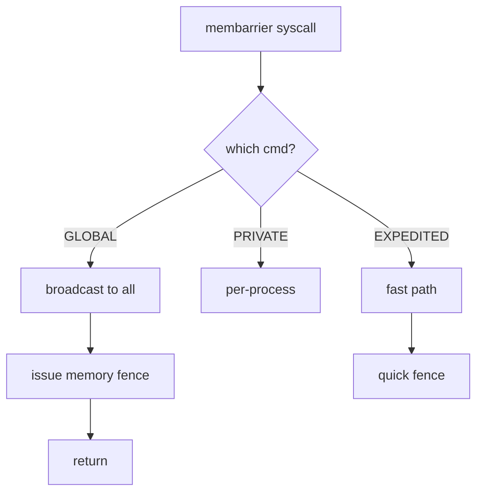

# Component: kern_membarrier.c

**Path:** `sys/kern/kern_membarrier.c`
**Type:** File
**Maps to:** `.discovery/sys/kern/kern_membarrier.md`

## Purpose

Memory barrier syscalls - implements the membarrier() system call for memory ordering. Provides fast cross-CPU memory barriers for userland synchronization.

## Structure

## Key Functions

| Function | Purpose | Signature |
|----------|---------|-----------|
| `sys_membarrier` | Main syscall | `int sys_membarrier(struct thread *td, ...)` |
| `membarrier_action_seqcst` | SEQ_CST fence | `void membarrier_action_seqcst(void *arg)` |
| `membarrier_private` | Private barrier | `int membarrier_private(void)` |

## Membarrier Commands

| Command | Description |
|---------|-------------|
| `MEMBARRIER_CMD_GLOBAL` | All threads |
| `MEMBARRIER_CMD_GLOBAL_EXPEDITED` | Fast global |
| `MEMBARRIER_CMD_PRIVATE_EXPEDITED` | Fast per-process |
| `MEMBARRIER_CMD_REGISTER_PRIVATE_EXPEDITED` | Register for private |
| `MEMBARRIER_CMD_GET_REGISTRATIONS` | Query registrations |

## Memory Order

| Type | Description |
|------|-------------|
| `SEQ_CST` | Sequential consistency |
| `EXPEDITED` | Fast, no wait |

## Use Cases

| Use | Description |
|-----|-------------|
| `RCU` | RCU synchronization |
| `locks` | Userland locks |

## Kernel Requirements

| Requirement | Description |
|-------------|-------------|
| `CPU_SUPPORT` | CPU membarrier |

## Includes

- `sys/membarrier.h` - Membarrier definitions

## Depends On

- `sys/cpuset.h` for CPU sets
- `machine/memops.h` for barriers