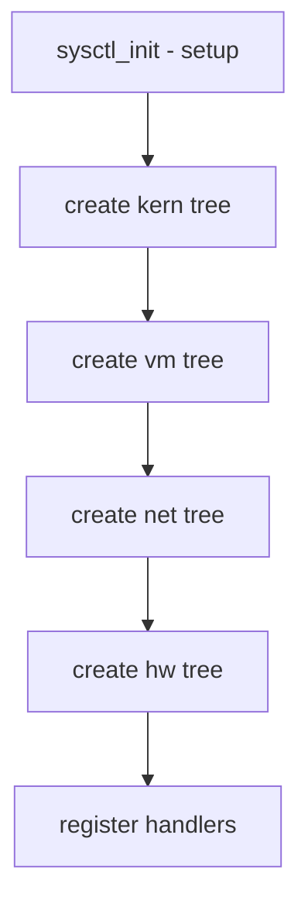

# Component: kern_mib.c

**Path:** `sys/kern/kern_mib.c`
**Type:** File
**Maps to:** `.discovery/sys/kern/kern_mib.md`

## Purpose

Sysctl MIB nodes - defines top-level kernel sysctl OIDs (Management Information Base). Creates the sysctl tree structure: kern, vm, net, debug, etc.

## Structure

## Top-Level OIDs

| OID | Description |
|-----|-------------|
| `CTL_KERN` | Kernel parameters |
| `CTL_VM` | Virtual memory |
| `CTL_NET` | Networking |
| `CTL_HW` | Hardware |
| `CTL_DEBUG` | Debug info |
| `CTL_USER` | User settings |

## Sysctl Handlers

| Handler | Purpose |
|---------|---------|
| `sysctl_handle_int` | Integer |
| `sysctl_handle_string` | String |
| `sysctl_handle_opaque` | Binary data |
| `sysctl_hierarchical` | Hierarchy |

## Kernel Sysctls

| Node | Description |
|------|-------------|
| `kern.version` | Kernel version |
| `kern.maxproc` | Max processes |
| `kern.osreldate` | OS release date |
| `kern.clockrate` | Clock rates |
| `kern.boottime` | Boot time |

## VM Sysctls

| Node | Description |
|------|-------------|
| `vm.loadavg` | Load average |
| `vm.vmtotal` | VM stats |
| `vm.swapinfo` | Swap usage |

## Includes

- `sys/sysctl.h` - Sysctl definitions

## Depends On

- `sys/mib.h` for MIB definitions
- `sys/kernel.h` for kernel info