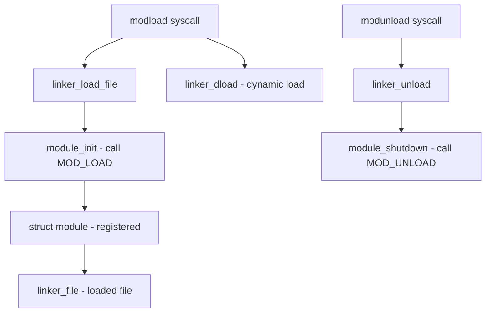

# Component: kern_module.c

**Path:** `sys/kern/kern_module.c`
**Type:** File
**Maps to:** `.discovery/sys/kern/kern_module.md`

## Purpose

Kernel module loader - manages dynamic loading and unloading of kernel modules (kld). Provides the module subsystem that allows adding functionality to the running kernel without rebooting.

## Structure



## Key Functions

| Function | Purpose | Signature |
|----------|---------|-----------|
| `sys_modnext` | Get next module ID | `int sys_modnext(struct thread *td, struct modnext_args *uap)` |
| `sys_modfnext` | Get next module of file | `int sys_modfnext(struct thread *td, struct modfnext_args *uap)` |
| `sys_modstat` | Get module status | `int sys_modstat(struct thread *td, struct modstat_args *uap)` |
| `sys_modload` | Load module | `int sys_modload(struct thread *td, struct modload_args *uap)` |
| `sys_modunload` | Unload module | `int sys_modunload(struct thread *td, struct modunload_args *uap)` |
| `module_register` | Register module | `int module_register(module_t mod)` |
| `module_unregister` | Unregister module | `void module_unregister(module_t mod)` |
| `linker_load_file` | Load ELF file | `int linker_load_file(const char *filename, linker_file_t *lf)` |
| `linker_file_from_fh` | Get file from file handle | `linker_file_t linker_file_from_fh(...)` |

## Module Structure

```c
struct module {
    TAILQ_ENTRY(module) link;     // All modules chain
    TAILQ_ENTRY(module) flink;    // Modules in file
    struct linker_file *file;      // Parent file
    int refs;                     // Reference count
    int id;                       // Unique ID
    char *name;                   // Module name
    modeventhand_t handler;       // Event handler
    void *arg;                    // Handler argument
    modspecific_t data;           // Module-specific data
};
```

## Module Events

| Event | Description |
|-------|-------------|
| `MOD_LOAD` | Module being loaded |
| `MOD_UNLOAD` | Module being unloaded |
| `MOD_SHUTDOWN` | System shutting down |
| `MOD_QUIESCE` | Module queried for unload |

## Includes

- `sys/module.h` - Module subsystem definitions
- `sys/linker.h` - Linker definitions
- `sys/proc.h` - Process structures

## Depends On

- `kern_linker.c` for ELF loading
- Device drivers use this to register
- `kern_kld.c` for kld subsystem