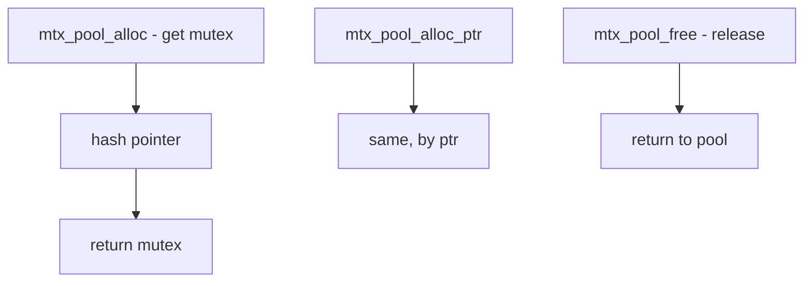

# Component: kern_mtxpool.c

**Path:** `sys/kern/kern_mtxpool.c`
**Type:** File
**Maps to:** `.discovery/sys/kern/kern_mtxpool.md`

## Purpose

Mutex pool - provides a pool of mutexes selectable by arbitrary pointer values. Used for short-term leaf mutexes without adding overhead to structures.

## Structure



## Key Functions

| Function | Purpose | Signature |
|----------|---------|-----------|
| `mtx_pool_alloc` | Allocate mutex | `struct mtx *mtx_pool_alloc(struct mtx_pool *pool, int flags)` |
| `mtx_pool_alloc_ptr` | Allocate by ptr | `struct mtx *mtx_pool_alloc_ptr(struct mtx_pool *pool, void *ptr, int flags)` |
| `mtx_pool_free` | Free mutex | `void mtx_pool_free(struct mtx_pool *pool, struct mtx *mtx)` |

## Mtx Pool Structure

```c
struct mtx_pool {
    struct mtx *mtp_mutexes;  // Array of mutexes
    int mtp_size;            // Pool size (power of 2)
    int mtp_mask;            // Mask for indexing
};
```

## Pool Types

| Type | Description |
|------|-------------|
| `MTX_POOL_SLEEP` | Sleep-safe |
| `MTX_POOL_NOSLEEP` | No sleep |

## Advantages

| Advantage | Description |
|-----------|-------------|
| No struct bloat | No per-object overhead |
| Any pointer | Works with invalid ptrs |
| No init needed | Dynamic allocation |

## Disadvantages

| Disadvantage | Description |
|--------------|-------------|
| Leaf only | Should be leaf mutex |
| No ordering | Pool dependencies |
| Cache contention | Possible on SMP |

## Uses

| Use | Description |
|-----|-------------|
| `vm_page` | Page mutexes |
| `bufcache` | Buffer cache |

## Includes

- `sys/mutex.h` - Mutex definitions

## Depends On

- `sys/mutex.h` for mutex ops
- `sys/malloc.h` for pool memory