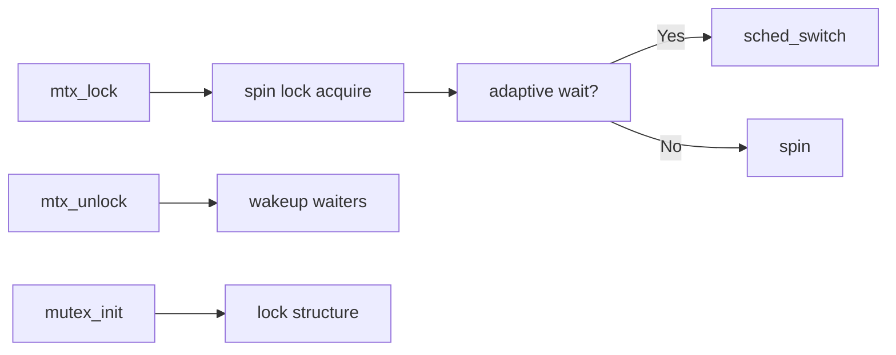

# Component: kern_mutex.c

**Path:** `sys/kern/kern_mutex.c`
**Type:** File
**Maps to:** `.discovery/sys/kern/kern_mutex.md`

## Purpose

Kernel mutex implementation - provides mutual exclusion primitives for kernel synchronization. Machine-independent layer over architecture-specific atomic operations and spin locks.

## Structure

## Key Functions

| Function | Purpose | Signature |
|----------|---------|-----------|
| `mutex_init` | Initialize mutex | `void mutex_init(struct mtx *m, const char *name, int opts)` |
| `mutex_destroy` | Destroy mutex | `void mutex_destroy(struct mtx *m)` |
| `mtx_lock` | Acquire lock | `void mtx_lock(struct mtx *m)` |
| `mtx_unlock` | Release lock | `void mtx_unlock(struct mtx *m)` |
| `mtx_trylock` | Try acquire | `int mtx_trylock(struct mtx *m)` |
| `mutex_spin_enter` | Enter spin section | `void mutex_spin_enter(struct mtx *m)` |
| `mutex_spin_exit` | Exit spin section | `void mutex_spin_exit(struct mtx *m)` |

## Mutex Types

| Type | Description |
|------|-------------|
| `MTX_DEF` | Default - can sleep |
| `MTX_SPIN` | Spin - never sleeps |
| `MTX_RECURSE` | Allow recursive |
| `MTX_QUIET` | Don't trace |

## Adaptive Mutexes

When adaptive mutex detects lock holder running on another CPU:
- Spin waiting briefly
- If not released, yield and sleep
- Configured via `NO_ADAPTIVE_MUTEXES` kernel option

## Includes

- `sys/mutex.h` - Mutex definitions
- `machine/atomic.h` - Atomic operations
- `sys/proc.h` - Process/scheduler
- `machine/cpu.h` - CPU-specific

## Depends On

- Used by ALL kernel subsystems
- `sys/sched.c` for adaptive mutex handling
- `machine/atomic.h` for lock primitives