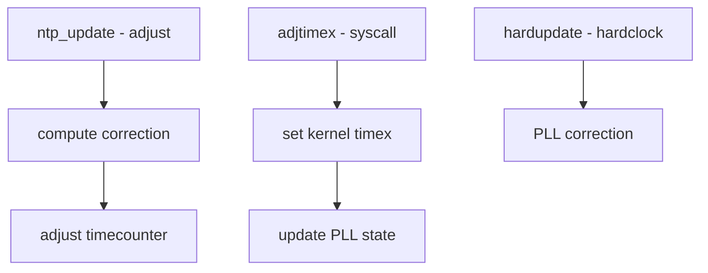

# Component: kern_ntptime.c

**Path:** `sys/kern/kern_ntptime.c`
**Type:** File
**Maps to:** `.discovery/sys/kern/kern_ntptime.md`

## Purpose

NTP timekeeping (kernel PLL) - implements the kernel-side NTP clock synchronization. Provides adjtimex syscall for controlling the Phase-Locked Loop.

## Structure



## Key Functions

| Function | Purpose | Signature |
|----------|---------|-----------|
| `ntp_update` | Update NTP | `void ntp_update(long tcsec, long tusec, int tcinc)` |
| `hardupdate` | Hard clock update | `static void hardupdate(long offset)` |
| `adjtimex` | User syscall | `int adjtimex(struct timex *tx)` |
| `ntp_gettimex` | Get NTP time | `int ntp_gettimex(struct ntptimeval *ntv)` |

## Timex Structure

```c
struct timex {
    int modes;          // Mode
    long offset;        // Time offset
    long freq;         // Frequency offset
    long maxerror;     // Max error
    long esterror;     // Est error
    long status;       // Status
    long constant;     // PLL constant
    long precision;    // Precision
    long tolerance;    // Tolerance
    // ...
};
```

## NTP State

| State | Description |
|-------|-------------|
| `STA_UNSYNC` | Unsynchronized |
| `STA_SYNC` | Synchronized |
| `STA_PLL` | PLL enabled |
| `STA_FLL` | FLL enabled |

## Modes

| Mode | Description |
|------|-------------|
| `ADJ_OFFSET` | Set offset |
| `ADJ_FREQUENCY` | Set frequency |
| `ADJ_MAXERROR` | Max error |
| `ADJ_ESTERROR` | Est error |
| `ADJ_STATUS` | Status |
| `ADJ_TIMECONST` | Time constant |

## PPS Synchronization

| Feature | Description |
|---------|-------------|
| `PPS_SYNC` | PPS signal sync |
| `hardpps` | Hard PPS update |

## Sysctl

| Node | Description |
|------|-------------|
| `kern.timecounter` | Timecounter settings |

## Includes

- `sys/timex.h` - Timex definitions
- `sys/timepps.h` - PPS definitions

## Depends On

- `kern_clocksource.c` for clock sources
- `sys/time.h` for time structures