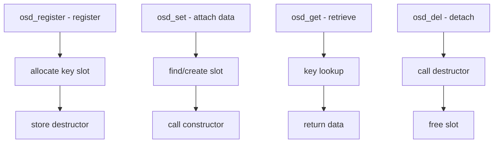

# Component: kern_osd.c

**Path:** `sys/kern/kern_osd.c`
**Type:** File
**Maps to:** `.discovery/sys/kern/kern_osd.md`

## Purpose

Object-Specific Data (OSD) - provides key-value data attachment mechanism for kernel objects. Allows modules to attach private data to objects like processes using a dynamic key system.

## Structure



## Key Functions

| Function | Purpose | Signature |
|----------|---------|-----------|
| `osd_register` | Register class | `int osd_register(const struct osd *osd)` |
| `osd_set` | Set data | `void *osd_set(struct osd_head *head, int key, void *data)` |
| `osd_get` | Get data | `void *osd_get(const struct osd_head *head, int key)` |
| `osd_del` | Delete data | `void osd_del(struct osd_head *head, int key)` |
| `osd_free` | Free all | `void osd_free(struct osd_head *head)` |

## OSD Structure

```c
struct osd {
    int osd_key;           // Key
    void *osd_data;       // Data pointer
    LIST_ENTRY(osd) osd_link;  // Hash link
};

struct osd_head {
    struct osd *osd_bucket[OSD_HASHSIZE];
};
```

## Methods

| Method | Description |
|--------|-------------|
| `OSD_MTX_CONSTRUCT` | Mutex construct |
| `OSD_MTX_DESTRUCT` | Mutex destruct |
| `OSD_COPY` | Copy on fork |

## OSD Uses

| Use | Description |
|-----|-------------|
| `jail` | Jail metadata |
| `proc` | Process data |
| `mac` | MAC framework |

## OSD Registration

```c
struct osd_method_descr {
    osd_method_t omd_methods[OSD_MAXMETHODS];
};
```

## Includes

- `sys/osd.h` - OSD definitions

## Depends On

- `sys/mutex.h` for locking
- `sys/queue.h` for lists