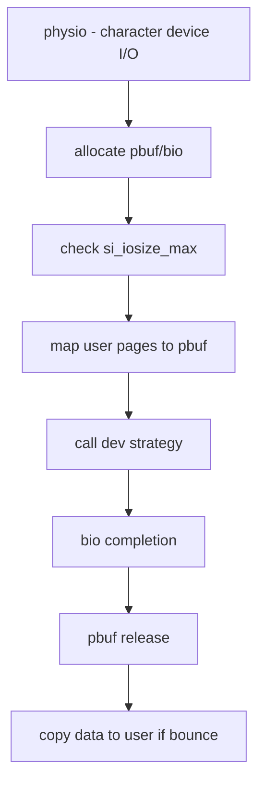

# Component: kern_physio.c

**Path:** `sys/kern/kern_physio.c`
**Type:** File
**Maps to:** `.discovery/sys/kern/kern_physio.md`

## Purpose

Physical I/O for character devices - handles direct physical I/O operations between user memory and device drivers. Manages bounce buffers for devices that cannot access all of physical memory directly.

## Structure

## Key Functions

| Function | Purpose | Signature |
|----------|---------|-----------|
| `physio` | Physical I/O entry point | `int physio(struct cdev *dev, struct uio *uio, int ioflag)` |
| `physio_start` | Start physio operation | `static int physio_start(struct cdevsw *csw, struct buf *pbuf)` |
| `physio_cleanup` | Cleanup after physio | `static void physio_cleanup(struct buf *pbuf)` |

## Key Constants

| Constant | Value | Description |
|----------|-------|-------------|
| `DFLTPHYS` | 64KB | Default max I/O size |
| `MAXPHYS` | 128KB | Maximum I/O size |
| `MAXPHYS_MIN` | 64KB | Minimum maximum I/O |

## Includes

- `sys/buf.h` - Buffer I/O structures
- `sys/bio.h` - Block I/O structures
- `vm/vm_page.h` - Physical page management
- `vm/vm_object.h` - VM objects

## Depends On

- Used by raw device I/O (character devices)
- `geom/geom.h` for GEOM integration
- `vm/vm_map.c` for user memory mapping