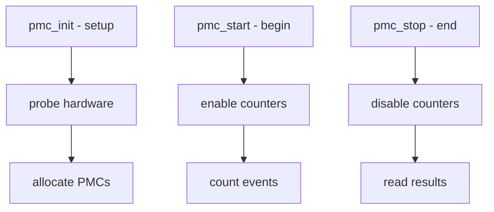

# Component: kern_pmc.c

**Path:** `sys/kern/kern_pmc.c`
**Type:** File
**Maps to:** `.discovery/sys/kern/kern_pmc.md`

## Purpose

Performance Monitoring Counters (PMC) - provides kernel interface to hardware performance counters. Allows profiling CPU events like cache misses, branch mispredictions, etc.

## Structure

## Key Functions

| Function | Purpose | Signature |
|----------|---------|-----------|
| `pmc_init` | Initialize | `int pmc_init(void)` |
| `pmc_start` | Start counting | `int pmc_start(int pmc)` |
| `pmc_stop` | Stop counting | `int pmc_stop(int pmc)` |
| `pmc_read` | Read counter | `int pmc_read(int pmc, uint64_t *result)` |
| `pmc_alloc` | Allocate PMC | `int pmc_alloc(struct pmc *pm)` |

## PMC Events

| Event | Description |
|-------|-------------|
| `PMC_PM_CYCLES` | CPU cycles |
| `PMC_PM_INSTR` | Instructions |
| `PMC_PM_L1MISS` | L1 cache miss |
| `PMC_PM_L2MISS` | L2 cache miss |
| `PMC_PM_BRANCHMIS` | Branch miss |

## PMC Flags

| Flag | Description |
|------|-------------|
| `PMC_FLG_SOFTWARE` | Software PMC |
| `PMC_FLG_HARDWARE` | Hardware PMC |
| `PMC_FLG_PERCPU` | Per-CPU |

## PMC Classes

| Class | Description |
|-------|-------------|
| `PMC_CLASS_SOFT` | Software events |
| `PMC_CLASS_UCF` | Unhalted cycles |
| `PMC_CLASS_IAP` | Inst address |

## Sysctl

| Node | Description |
|------|-------------|
| `hw.pmcr` | PMC info |
| `hw.pmcn` | PMC count |

## HWPMC Hooks

| Hook | Description |
|------|-------------|
| `PMC_SOFT_DECLARE` | Soft PMC |
| `PMC_CALL_HOOK` | Invoke hooks |

## Includes

- `sys/pmc.h` - PMC definitions
- `sys/pmckern.h` - PMC kernel hooks

## Depends On

- `machine/pmc.h` for MD support
- `sys/smp.h` for SMP