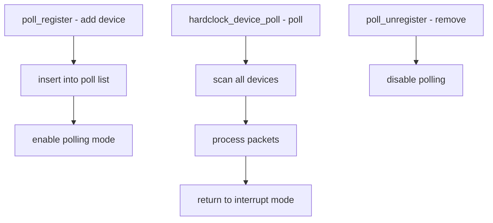

# Component: kern_poll.c

**Path:** `sys/kern/kern_poll.c`
**Type:** File
**Maps to:** `.discovery/sys/kern/kern_poll.md`

## Purpose

Device polling - provides interrupt-less polling I/O for network drivers. Allows low-latency, high-throughput packet processing by periodically polling devices.

## Structure

## Key Functions

| Function | Purpose | Signature |
|----------|---------|-----------|
| `poll_register` | Register device | `int poll_register(struct ifnet *ifp)` |
| `poll_unregister` | Unregister | `int poll_unregister(struct ifnet *ifp)` |
| `hardclock_device_poll` | Poll all | `void hardclock_device_poll(void)` |
| `dev_poll` | Per-device | `void dev_poll(struct ifnet *ifp)` |

## Polling Parameters

| Parameter | Description |
|-----------|-------------|
| `hz` | Poll frequency |
| `bundlesize` | Max packets/poll |

## Polling Mode

| Mode | Description |
|------|-------------|
| `POLL_MODE_NORMAL` | Normal polling |
| `POLL_MODE_DISABLE` | Disabled |

## Device Requirements

| Requirement | Description |
|-------------|-------------|
| `IFF_POLLING` | Driver supports |
| `IFCAP_POLLING` | Capability flag |

## Use Cases

| Use | Description |
|-----|-------------|
| `10G+ NICs` | High-speed networking |
| `low latency` | Real-time apps |

## Sysctl

| Node | Description |
|------|-------------|
| `kern.polling` | Polling settings |
| `net.isr` | ISR settings |

## Includes

- `net/if.h` for network interfaces
- `net/netisr.h` for netisr

## Depends On

- `kern_hardclock.c` for polling clock
- `net/if_var.h` for ifnet