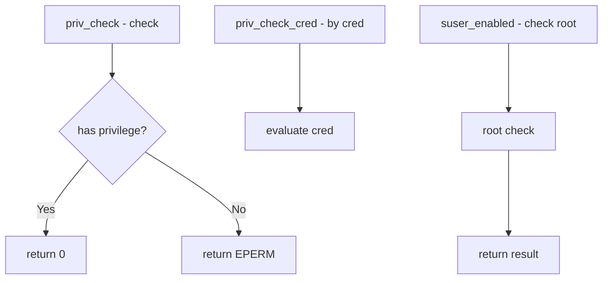

# Component: kern_priv.c

**Path:** `sys/kern/kern_priv.c`
**Type:** File
**Maps to:** `.discovery/sys/kern/kern_priv.md`

## Purpose

Privilege checking - implements privilege framework for FreeBSD. Handles super-user checks and the privilege system for capability mode.

## Structure

## Key Functions

| Function | Purpose | Signature |
|----------|---------|-----------|
| `priv_check` | Check privilege | `int priv_check(struct thread *td, int priv)` |
| `priv_check_cred` | Check for cred | `int priv_check_cred(struct ucred *cred, int priv, int flags)` |
| `suser_enabled` | Root check | `static bool suser_enabled(struct ucred *cred)` |
| `suser` | Legacy superuser | `int suser(struct thread *td)` |

## Privileges

| Privilege | Description |
|-----------|-------------|
| `PRIV_KMEM_READ` | Read kernel memory |
| `PRIV_KMEM_WRITE` | Write kernel memory |
| `PRIV_KVM_READ` | Read kernel VM |
| `PRIV_KVM_WRITE` | Write kernel VM |
| `PRIV_IO` | Direct I/O |
| `PRIV_NETWORK` | Network privileges |
| `PRIV_PROC_DEBUG` | Debug processes |
| `PRIV_PROC_EXEC` | Execute programs |

## Suser Options

| Option | Description |
|--------|-------------|
| `suser_enabled` | Enable root check |
| `security.bsd.suser_enabled` | Sysctl |

## Flags

| Flag | Description |
|------|-------------|
| `PRIV_CHECK_DTRACE` | DTrace check |
| `PRIV_CHECK_NORMAL` | Normal check |

## DTrace Integration

| Probe | Description |
|-------|-------------|
| `priv-check` | Privilege check |

## Includes

- `sys/priv.h` - Privilege definitions

## Depends On

- `sys/ucred.h` for credentials
- `sys/proc.h` for process