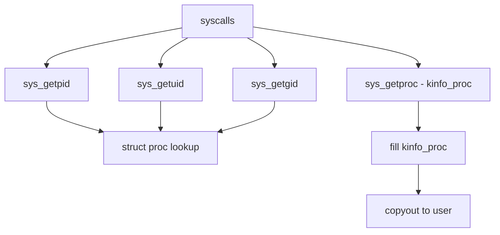

# Component: kern_proc.c

**Path:** `sys/kern/kern_proc.c`
**Type:** File
**Maps to:** `.discovery/sys/kern/kern_proc.md`

## Purpose

Process management - implements process and thread manipulation syscalls (getpid, getppid, getuid, etc.). Manages process credentials, identity, and basic process queries.

## Structure

## Key Functions

| Function | Purpose | Signature |
|----------|---------|-----------|
| `sys_getpid` | Get process ID | `int sys_getpid(struct thread *td)` |
| `sys_getppid` | Get parent PID | `int sys_getppid(struct thread *td)` |
| `sys_getuid` | Get real UID | `int sys_getuid(struct thread *td)` |
| `sys_geteuid` | Get effective UID | `int sys_geteuid(struct thread *td)` |
| `sys_getgid` | Get real GID | `int sys_getgid(struct thread *td)` |
| `sys_getegid` | Get effective GID | `int sys_getegid(struct thread *td)` |
| `sys_getresuid` | Get real/effective/saved UID | `int sys_getresuid(...)` |
| `sys_getresgid` | Get real/effective/saved GID | `int sys_getresgid(...)` |
| `sys_setuid` | Set UID | `int sys_setuid(struct thread *td, struct setuid_args *uap)` |
| `sys_setgid` | Set GID | `int sys_setgid(struct thread *td, struct setgid_args *uap)` |
| `sys_setsid` | Set session ID | `int sys_setsid(struct thread *td)` |
| `sys_setpgid` | Set process group | `int sys_setpgid(struct thread *td, struct setpgid_args *uap)` |
| `sys_getpgid` | Get process group | `int sys_getpgid(struct thread *td, struct getpgid_args *uap)` |
| `sys_getpgrp` | Get process group | `int sys_getpgrp(struct thread *td)` |
| `sys_kinfo_getproc` | Get process info | `int sys_kinfo_getproc(...)` |

## Process Credentials

| Function | Description |
|----------|-------------|
| `curthread->td_proc` | Current process |
| `p->p_ucred` | Process credentials |
| `cr_uid` | Real UID |
| `cr_ruid` | Real UID |
| `cr_svuid` | Saved UID |
| `cr_groups` | Supplementary groups |

## Includes

- `sys/proc.h` - Process structures
- `sys/resourcevar.h` - Resource limits
- `sys/ptrace.h` - Debugging/tracing

## Depends On

- All processes use these syscalls
- `kern_fork.c` for process creation
- `kern_exit.c` for process termination