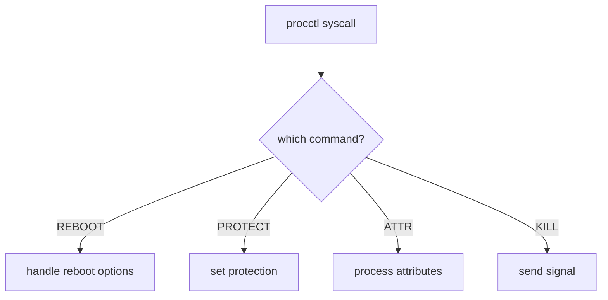

# Component: kern_procctl.c

**Path:** `sys/kern/kern_procctl.c`
**Type:** File
**Maps to:** `.discovery/sys/kern/kern_procctl.md`

## Purpose

Process control (procctl) - implements the procctl syscall for process control operations. Allows getting/setting various process properties and control operations.

## Structure

## Key Functions

| Function | Purpose | Signature |
|----------|---------|-----------|
| `sys_procctl` | Main syscall | `int sys_procctl(struct thread *td, ...)` |
| `procctl_reaper` | Reaper control | `int procctl_reaper(struct thread *td, ...)` |
| `procctl_reap` | Reap children | `int procctl_reap(struct thread *td, ...)` |
| `protect_setchild` | Set protection | `static int protect_setchild(...)` |

## Procctl Commands

| Command | Description |
|---------|-------------|
| `PROC_SEGV_FAULT_SPAWN` | Segfault spawn |
| `PROC_REAP_ACQUIRE` | Acquire reaper |
| `PROC_REAP_RELEASE` | Release reaper |
| `PROC_REAP_GETPIDS` | Get child PIDs |
| `PROC_PROTECT` | Process protection |

## Process Attributes

| Attribute | Description |
|-----------|-------------|
| `PROC_ATTR` | Process attributes |
| `PROC_PIDATTR` | Per-PID attributes |

## Protection Flags

| Flag | Description |
|------|-------------|
| `PPROT_NORMAL` | Normal |
| `PPROTECT` | Protected |

## Reaper Operations

| Op | Description |
|----|-------------|
| `REAP_ACQUIRE` | Become reaper |
| `REAP_RELEASE` | Stop reaping |
| `REAP_GETPIDS` | List children |

## Uses

| Use | Description |
|-----|-------------|
| `Capsicum` | Process isolation |
| `Linux compat` | Linux emulation |

## Includes

- `sys/procctl.h` - Procctl definitions

## Depends On

- `sys/proc.h` for process
- `sys/sx.h` for sx locks