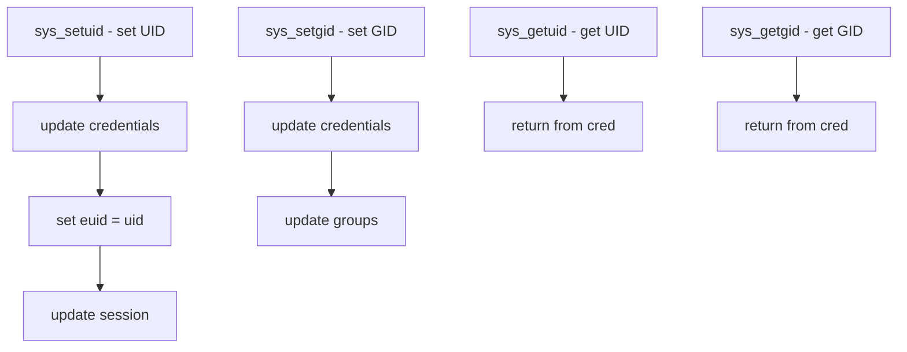

# Component: kern_prot.c

**Path:** `sys/kern/kern_prot.c`
**Type:** File
**Maps to:** `.discovery/sys/kern/kern_prot.md`

## Purpose

Process protection syscalls - implements credential manipulation syscalls (getuid, geteuid, setuid, getgid, setgid, etc.) for user/group identity management.

## Structure

## Key Functions

| Function | Purpose | Signature |
|----------|---------|-----------|
| `sys_setuid` | Set UID | `int sys_setuid(struct thread *td, ...)` |
| `sys_setgid` | Set GID | `int sys_setgid(struct thread *td, ...)` |
| `sys_seteuid` | Set effective UID | `int sys_seteuid(struct thread *td, ...)` |
| `sys_setegid` | Set effective GID | `int sys_setegid(struct thread *td, ...)` |
| `sys_setreuid` | Set real/eff UID | `int sys_setreuid(struct thread *td, ...)` |
| `sys_setregid` | Set real/eff GID | `int sys_setregid(struct thread *td, ...)` |
| `sys_getuid` | Get UID | `int sys_getuid(void)` |
| `sys_getgid` | Get GID | `int sys_getgid(void)` |

## Credential Components

| Component | Description |
|-----------|-------------|
| `uid` | Real UID |
| `euid` | Effective UID |
| `suid` | Saved UID |
| `gid` | Real GID |
| `egid` | Effective GID |
| `sgid` | Saved GID |

## Set-ID Modes

| Mode | Description |
|------|-------------|
| `SETUID` | Can set all UIDs |
| `SETEUID` | Can set EUID only |
| `SETREUID` | Set real and eff |

## Special UIDs

| UID | Description |
|-----|-------------|
| `0` | Superuser (root) |
| `-1` | Nobody (no change) |

## Groups

| Type | Description |
|------|-------------|
| `rgid` | Real GID |
| `egid` | Effective GID |
| `svgid` | Saved GID |
| `groups` | Supplementary groups |

## Includes

- `sys/ucred.h` for credentials
- `sys/proc.h` for process

## Depends On

- `sys/ucred.h` for cred ops
- `sys/session.h` for sessions