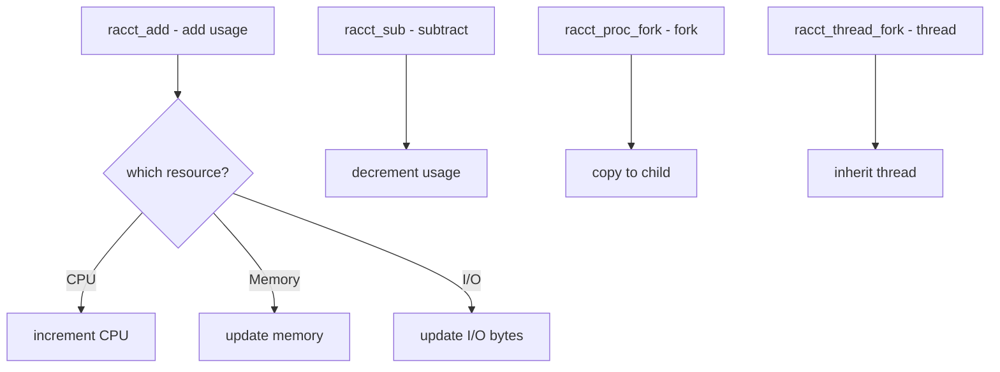

# Component: kern_racct.c

**Path:** `sys/kern/kern_racct.c`
**Type:** File
**Maps to:** `.discovery/sys/kern/kern_racct.md`

## Purpose

Resource accounting (racct) - tracks resource usage for processes and jails. Records CPU time, memory usage, I/O, and other resources for accounting and limit enforcement.

## Structure



## Key Functions

| Function | Purpose | Signature |
|----------|---------|-----------|
| `racct_add` | Add resource | `void racct_add(struct racct *racct, int type, uint64_t val)` |
| `racct_sub` | Subtract resource | `void racct_sub(struct racct *racct, int type, uint64_t val)` |
| `racct_set` | Set resource | `void racct_set(struct racct *racct, int type, uint64_t val)` |
| `racct_proc_fork` | Fork accounting | `void racct_proc_fork(struct proc *parent, struct proc *child)` |
| `racct_thread_fork` | Thread accounting | `void racct_thread_fork(struct thread *td)` |

## Resource Types

| Type | Description |
|------|-------------|
| `RACCT_CPU` | CPU time |
| `RACCT_MEMORY` | Memory usage |
| `RACCT_VMEM` | Virtual memory |
| `RACCT_NPROC` | Process count |
| `RACCT_NTHR` | Thread count |
| `RACCT_FILES` | File descriptor count |
| `RACCT_FSIZE` | File size |
| `RACCT_DATA` | Data size |
| `RACCT_STACK` | Stack size |

## Racct Structure

```c
struct racct {
    uint64_t rac_resources[RACCT_MAX];
    int rac_flags;
};
```

## Usage Tracking

| Field | Description |
|-------|-------------|
| `cur` | Current usage |
| `max` | Peak usage |

## RCTL Integration

| Integration | Description |
|-------------|-------------|
| `rctl` | Resource limits |
| `jail` | Jail limits |

## Includes

- `sys/racct.h` - Resource accounting

## Depends On

- `sys/proc.h` for process
- `sys/rctl.h` for limits