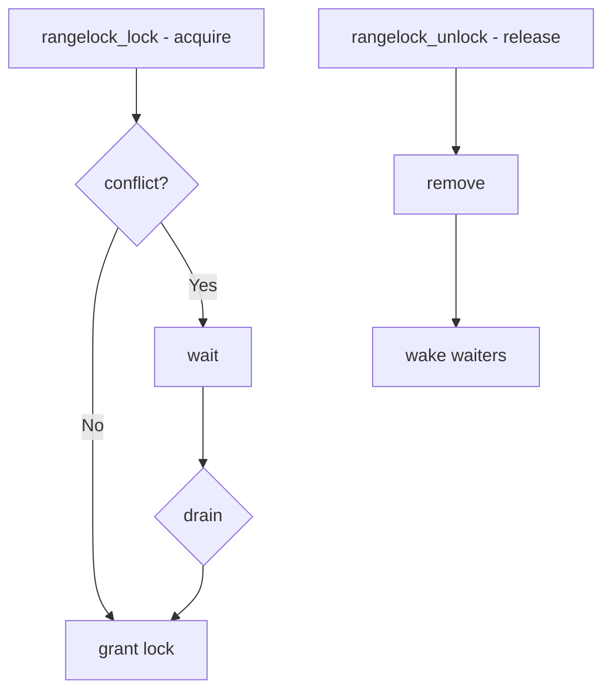

# Component: kern_rangelock.c

**Path:** `sys/kern/kern_rangelock.c`
**Type:** File
**Maps to:** `.discovery/sys/kern/kern_rangelock.md`

## Purpose

Range locks - provides byte-range locking for resources. Allows concurrent access to different ranges of the same object (like file regions).

## Structure



## Key Functions

| Function | Purpose | Signature |
|----------|---------|-----------|
| `rangelock_init` | Initialize | `void rangelock_init(struct rangelock *lk)` |
| `rangelock_lock` | Acquire lock | `int rangelock_lock(struct rangelock *lk, ...)` |
| `rangelock_unlock` | Release lock | `void rangelock_unlock(struct rangelock *lk, ...)` |
| `rangelock_downgrade` | Upgrade→shared | `void rangelock_downgrade(struct rangelock *lk)` |
| `rangelock_upgrade` | Shared→exclusive | `int rangelock_upgrade(struct rangelock *lk, ...)` |

## Lock Modes

| Mode | Description |
|------|-------------|
| `RL_READER` | Shared (read) |
| `RL_WRITER` | Exclusive (write) |

## Range Lock Structure

```c
struct rangelock {
    struct mtx lock;           // Base lock
    TAILQ_HEAD(, lock_range) holders;  // Active locks
    TAILQ_HEAD(, lock_range) waiters;  // Waiting locks
};
```

## Cheating Mode

| Mode | Description |
|------|-------------|
| `CHEATING` | Fast path, like sx |
| `TRACKED` | Per-range tracking |

## Range Conflicts

| Conflict | Description |
|----------|-------------|
| `read/read` | OK (same range) |
| `read/write` | Conflict |
| `write/read` | Conflict |
| `write/write` | Conflict |

## Uses

| Use | Description |
|-----|-------------|
| `vnode` | File range locks |
| `device` | Device regions |

## Includes

- `sys/rangelock.h` - Range lock definitions

## Depends On

- `sys/sleepqueue.h` for sleeping
- `vm/uma.h` for uma