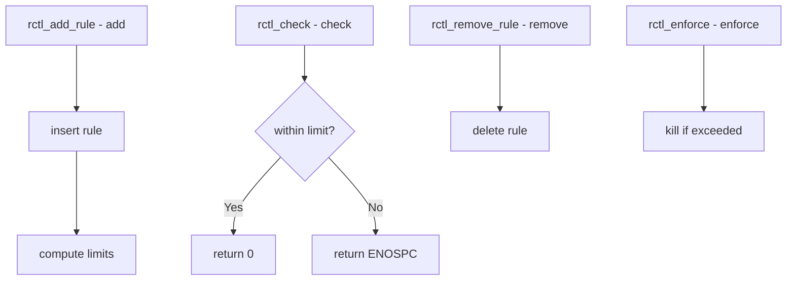

# Component: kern_rctl.c

**Path:** `sys/kern/kern_rctl.c`
**Type:** File
**Maps to:** `.discovery/sys/kern/kern_rctl.md`

## Purpose

Resource limits (RCTL) - implements resource limit framework for FreeBSD. Enforces limits on process and jail resources like CPU, memory, files, etc.

## Structure



## Key Functions

| Function | Purpose | Signature |
|----------|---------|-----------|
| `rctl_add_rule` | Add limit rule | `int rctl_add_rule(const char *ruleset, ...)` |
| `rctl_remove_rule` | Remove rule | `int rctl_remove_rule(const char *ruleset, ...)` |
| `rctl_check` | Check limit | `int rctl_check(struct rctl *r, ...)` |
| `rctl_enforce` | Enforce limit | `void rctl_enforce(struct rctl *r)` |
| `rctl_get_limits` | Get limits | `int rctl_get_limits(const char *res, ...)` |

## RCTL Rules

| Rule | Description |
|------|-------------|
| `user:uid:maxproc` | Max processes per user |
| `jail:jailname:memory*` | Jail memory limits |

## Rule Actions

| Action | Description |
|--------|-------------|
| `deny` | Reject allocation |
| `log` | Log event |
| `devctl` | Send devctl event |
| `kill` | Kill process |

## Resource Types

| Resource | Description |
|----------|-------------|
| `maxproc` | Max processes |
| `maxprocperuid` | Max per UID |
| `memory*` | Memory limits |
| `files` | Open files |
| `filesperproc` | Files per process |

## Rctl Structure

```c
struct rctl {
    const char *name;      // Resource name
    uint64_t value;       // Limit value
    int action;           // Action on exceed
};
```

## Uses

| Use | Description |
|-----|-------------|
| `jail` | Jail limits |
| `loginclass` | Per-class limits |
| `user` | Per-user limits |

## Includes

- `sys/rctl.h` - Resource limits

## Depends On

- `sys/racct.h` for accounting
- `sys/proc.h` for process