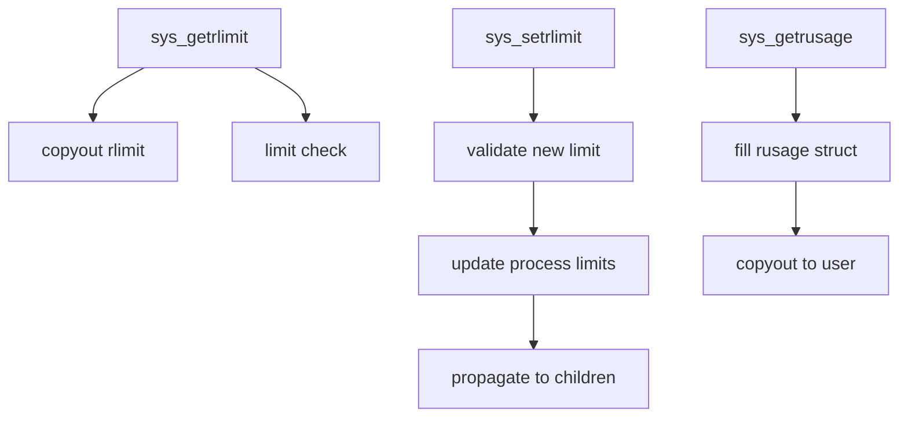

# Component: kern_resource.c

**Path:** `sys/kern/kern_resource.c`
**Type:** File
**Maps to:** `.discovery/sys/kern/kern_resource.md`

## Purpose

Resource usage and limits - implements getrlimit, setrlimit, getrusage syscalls. Controls process resource consumption including CPU time, file size, memory, and process counts.

## Structure



## Key Functions

| Function | Purpose | Signature |
|----------|---------|-----------|
| `sys_getrlimit` | Get resource limits | `int sys_getrlimit(struct thread *td, struct getrlimit_args *uap)` |
| `sys_setrlimit` | Set resource limits | `int sys_setrlimit(struct thread *td, struct setrlimit_args *uap)` |
| `sys_getrusage` | Get resource usage | `int sys_getrusage(struct thread *td, struct getrusage_args *uap)` |
| `lim_cur` | Get current limit | `uimax_t lim_cur(int which, struct rlimit *lim)` |
| `lim_max` | Get maximum limit | `uimax_t lim_max(int which, struct rlimit *lim)` |

## Resource Types (rlim_ids)

| ID | Resource | Description |
|----|----------|-------------|
| `RLIMIT_CPU` | CPU time | Max CPU seconds |
| `RLIMIT_FSIZE` | File size | Max file bytes |
| `RLIMIT_DATA` | Data | Max data segment |
| `RLIMIT_STACK` | Stack | Max stack size |
| `RLIMIT_RSS` | RSS | Max resident set |
| `RLIMIT_NPROC` | Processes | Max process count |
| `RLIMIT_NOFILE` | Files | Max file descriptors |
| `RLIMIT_MEMLOCK` | Memory lock | Max locked memory |
| `RLIMIT_NPTS` | Pseudo-ttys | Max pseudo-ttys |

## rusage Structure

```c
struct rusage {
    struct timeval ru_utime;    // User time
    struct timeval ru_stime;    // System time
    long ru_maxrss;             // Max RSS
    long ru_ixrss;             // Shared mem size
    long ru_idrss;             // Data segment size
    long ru_isrss;             // Stack size
    // ... more fields
};
```

## Includes

- `sys/resourcevar.h` - Resource variables
- `sys/racct.h` - Resource accounting
- `sys/proc.h` - Process structures

## Depends On

- `kern_racct.c` for resource accounting
- Used by `kern_fork.c` for limit inheritance
- `kern_exit.c` for final usage recording