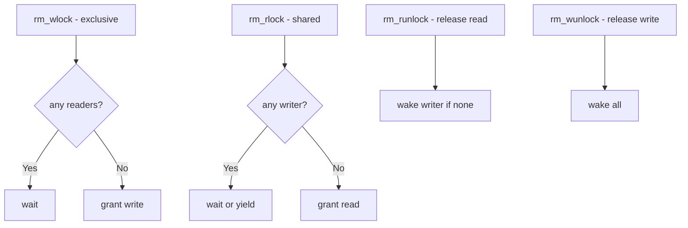

# Component: kern_rmlock.c

**Path:** `sys/kern/kern_rmlock.c`
**Type:** File
**Maps to:** `.discovery/sys/kern/kern_rmlock.md`

## Purpose

Reader/writer lock (rmlock) - implements shared/exclusive locks with priority inheritance. Allows multiple readers or single writer with better reader concurrency than sx locks.

## Structure



## Key Functions

| Function | Purpose | Signature |
|----------|---------|-----------|
| `rm_wlock` | Acquire exclusive | `void rm_wlock(struct rmlock *rm)` |
| `rm_wunlock` | Release exclusive | `void rm_wunlock(struct rmlock *rm)` |
| `rm_rlock` | Acquire shared | `void rm_rlock(struct rmlock *rm, struct rm_pri_track *rt)` |
| `rm_runlock` | Release shared | `void rm_runlock(struct rmlock *rm, struct rm_pri_track *rt)` |
| `rm_init` | Initialize | `void rm_init(struct rmlock *rm, const char *name)` |

## RMLock Structure

```c
struct rmlock {
    struct mtx lock;           // Base lock
    TAILQ_HEAD(, rm_pri_track) writers;  // Waiting writers
    uint8_t r_state;          // State flags
    const char *name;         // Name
};
```

## Lock States

| State | Description |
|-------|-------------|
| `RMLOCK_UNLOCKED` | No lock |
| `RMLOCK_READER` | Has readers |
| `RMLOCK_WRITER` | Has writer |

## Priority Tracking

| Type | Description |
|------|-------------|
| `rm_pri_track` | Priority tracking |

## Advantages over SX

| Advantage | Description |
|-----------|-------------|
| Concurrent reads | Multiple readers |
| Priority inheritance | Prevents starvation |

## Uses

| Use | Description |
|-----|-------------|
| `VFS` | Filesystem locks |
| `vnodes` | Vnode operations |

## Includes

- `sys/rmlock.h` - RMLock definitions

## Depends On

- `sys/turnstile.h` for waiting
- `sys/sched.h` for scheduling