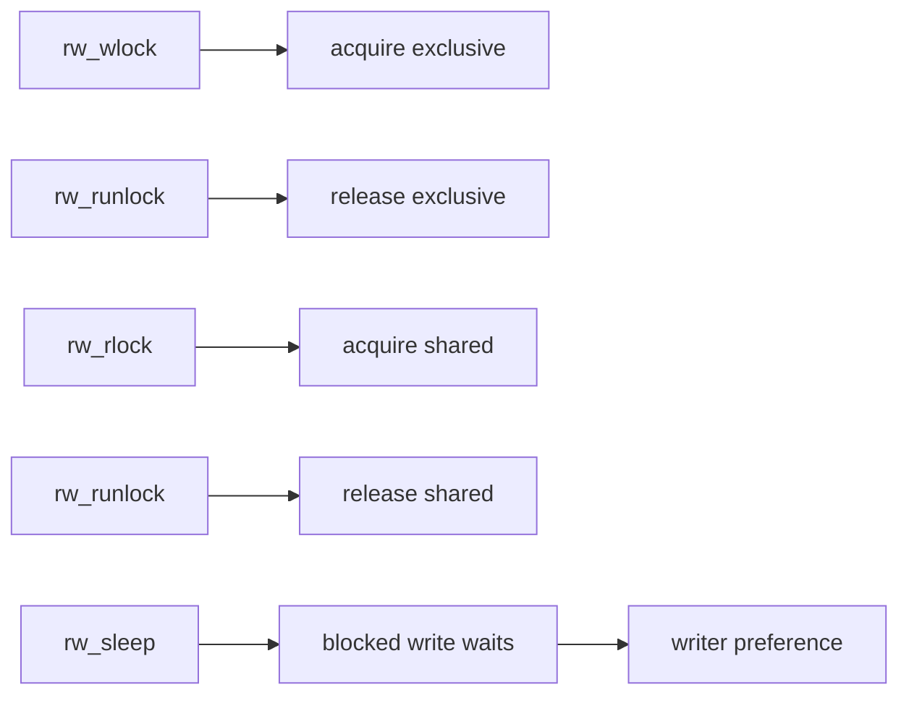

# Component: kern_rwlock.c

**Path:** `sys/kern/kern_rwlock.c`
**Type:** File
**Maps to:** `.discovery/sys/kern/kern_rwlock.md`

## Purpose

Reader/writer locks - implements exclusive/shared locking primitive. Allows multiple readers OR a single writer, providing better concurrency than mutexes for read-heavy workloads.

## Structure

## Key Functions

| Function | Purpose | Signature |
|----------|---------|-----------|
| `rw_init` | Initialize rwlock | `void rw_init(struct rwlock *rw, const char *name)` |
| `rw_destroy` | Destroy rwlock | `void rw_destroy(struct rwlock *rw)` |
| `rw_wlock` | Acquire write lock | `void rw_wlock(struct rwlock *rw)` |
| `rw_wunlock` | Release write lock | `void rw_wunlock(struct rwlock *rw)` |
| `rw_rlock` | Acquire read lock | `void rw_rlock(struct rwlock *rw)` |
| `rw_runlock` | Release read lock | `void rw_runlock(struct rwlock *rw)` |
| `rw_try_wlock` | Try write lock | `int rw_try_wlock(struct rwlock *rw)` |
| `rw_try_rlock` | Try read lock | `int rw_try_rlock(struct rwlock *rw)` |
| `rw_assert` | Assert lock state | `void rw_assert(struct rwlock *rw, int what)` |

## Lock States

| State | Description |
|-------|-------------|
| `RA_RLOCK` | Read lock held |
| `RA_WLOCK` | Write lock held |
| `RA_UNLOCKED` | No locks held |

## Adaptive RWLocks

When `ADAPTIVE_RWLOCKS` defined:
- Writers spin waiting if holder running
- Prevents writer starvation
- Configurable via `NO_ADAPTIVE_RWLOCKS`

## Includes

- `sys/rwlock.h` - Reader/writer lock definitions
- `sys/turnstile.h` - Turnstile for sleeping
- `sys/sched.h` - Scheduling integration

## Depends On

- Used throughout kernel for concurrent read access
- `kern_mutex.c` for base primitives