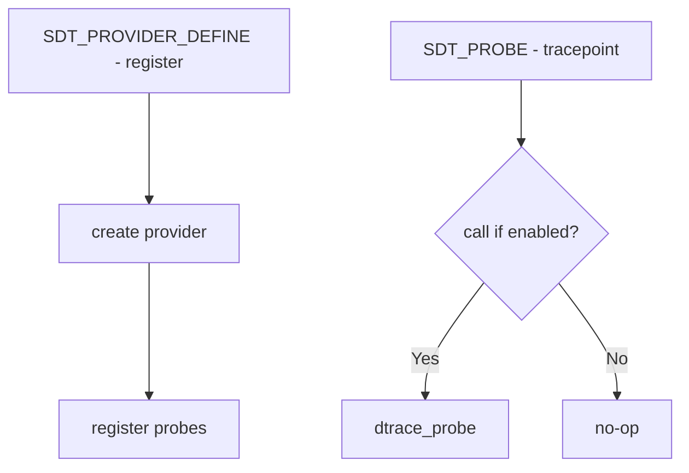

# Component: kern_sdt.c

**Path:** `sys/kern/kern_sdt.c`
**Type:** File
**Maps to:** `.discovery/sys/kern/kern_sdt.md`

## Purpose

Statically Defined Tracing (SDT) - provides static tracepoints for DTrace. Allows DTrace to instrument kernel code at predefined probe points.

## Structure



## Key Components

| Component | Description |
|-----------|-------------|
| `SDT_PROVIDER_DEFINE` | Define provider |
| `SDT_PROBE_DEFINE` | Define probe |
| `SDT_PROBE` | Fire probe |
| `sdt_probe_func` | Probe function pointer |

## SDT Macros

| Macro | Purpose |
|-------|---------|
| `SDT_PROVIDER_DEFINE(name)` | Define provider |
| `SDT_PROBE_DEFINE(provider, module, function, name)` | Define probe |
| `SDT_PROBE(name)` | Fire probe |
| `SDT_PROBE1(provider, ...)` | Fire with 1 arg |

## SDT Provider

```c
SDT_PROVIDER_DEFINE(sdt);
```

## Example Probes

| Probe | Description |
|-------|-------------|
| `sdt:::io-start` | I/O start |
| `sdt:::io-done` | I/O done |
| `sdt:::tcp-connect` | TCP connect |

## Probe Arguments

| Args | Description |
|------|-------------|
| `arg0-arg5` | Up to 6 arguments |

## Stub

| Function | Description |
|----------|-------------|
| `sdt_probe_stub` | Fallback when no DTrace |

## Includes

- `sys/sdt.h` - SDT definitions

## Depends On

- `sys/dtrace.h` for DTrace integration