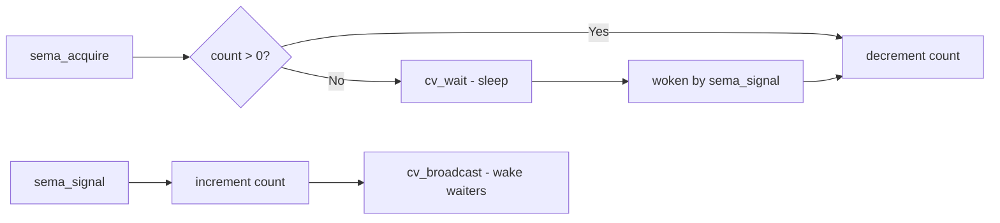

# Component: kern_sema.c

**Path:** `sys/kern/kern_sema.c`
**Type:** File
**Maps to:** `.discovery/sys/kern/kern_sema.md`

## Purpose

Counting semaphores - implements the semaphore synchronization primitive for kernel code. Provides acquire/release operations on counted resources with optional timeout support.

## Structure



## Key Functions

| Function | Purpose | Signature |
|----------|---------|-----------|
| `sema_init` | Initialize semaphore | `void sema_init(struct sema *sema, int value, const char *desc)` |
| `sema_destroy` | Destroy semaphore | `void sema_destroy(struct sema *sema)` |
| `sema_acquire` | Acquire semaphore | `int sema_acquire(struct sema *sema)` |
| `sema_try_acquire` | Try acquire | `int sema_try_acquire(struct sema *sema)` |
| `sema_release` | Release semaphore | `void sema_release(struct sema *sema)` |
| `sema_wait` | Wait with mutex | `int sema_wait(struct sema *sema)` |
| `sema_signal` | Signal/wake one | `void sema_signal(struct sema *sema)` |
| `sema_broadcast` | Wake all waiters | `void sema_broadcast(struct sema *sema)` |

## Data Structure

```c
struct sema {
    int sema_value;          // Current count
    struct mtx sema_mtx;     // Backing lock
    struct cv sema_cv;       // Wait channel
};
```

## Notes

- Priority propagation does NOT raise owner priority
- Cannot rely on semaphores for priority inheritance
- Uses cv_broadcast for fair wakeup

## Includes

- `sys/sema.h` - Semaphore definitions
- `sys/condvar.h` - Condition variables
- `sys/mutex.h` - Mutex primitives

## Depends On

- Used by various kernel subsystems
- `kern_condvar.c` for cv operations