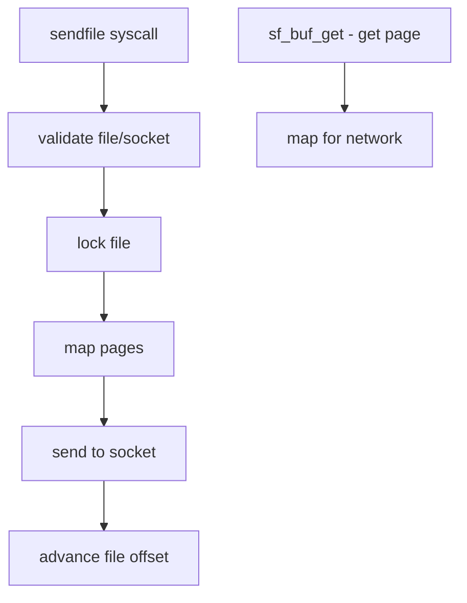

# Component: kern_sendfile.c

**Path:** `sys/kern/kern_sendfile.c`
**Type:** File
**Maps to:** `.discovery/sys/kern/kern_sendfile.md`

## Purpose

Sendfile syscall - implements efficient file-to-socket data transfer. Transfers data directly from file to socket without copying through userland for high performance.

## Structure

## Key Functions

| Function | Purpose | Signature |
|----------|---------|-----------|
| `sys_sendfile` | Main syscall | `int sys_sendfile(struct thread *td, ...)` |
| `sendfile_tramp` | Async trampoline | `void sendfile_tramp(void *arg)` |
| `sf_buf_get` | Get sendfile buf | `struct sf_buf *sf_buf_get(struct vm_page *m, int idx)` |
| `sf_buf_rel` | Release buffer | `void sf_buf_rel(struct sf_buf *sf)` |

## Sendfile Flags

| Flag | Description |
|------|-------------|
| `SF_FLAGS` | Flags mask |
| `SF_NDISCON` | Disconnect after |
| `SF_SYNC` | Synchronous |
| `SF_RECLAIM` | Reclaim buffers |

## Sendfile Arguments

| Arg | Description |
|-----|-------------|
| `fd` | File descriptor |
| `s` | Socket fd |
| `offset` | File offset |
| `nbytes` | Bytes to send |
| `hdrbuf` | Header buffer |
| `trlbuf` | Trailer buffer |
| `sbytes` | Sent bytes (out) |
| `flags` | Flags |

## Page Cache (sf_buf)

| Feature | Description |
|---------|-------------|
| `mbufs` | Cluster mbufs |
| `DMA` | Direct DMA mapping |
| `TLS` | Kernel TLS |

## Kernel TLS

| Mode | Description |
|------|-------------|
| `KTLS_DIO` | Direct I/O |
| `KTLS_KERNEL` | Kernel TLS |

## Uses

| Use | Description |
|-----|-------------|
| `HTTP servers` | Fast file serving |
| `TFTP` | File transfer |

## Includes

- `sys/sf_buf.h` - Sendfile buffer

## Depends On

- `vm/vm_page.h` for page mapping
- `netinet/tcp_var.h` for TCP