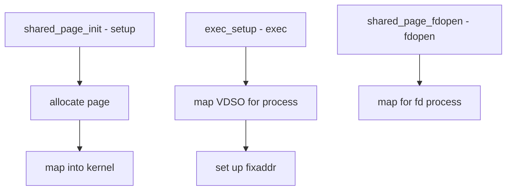

# Component: kern_sharedpage.c

**Path:** `sys/kern/kern_sharedpage.c`
**Type:** File
**Maps to:** `.discovery/sys/kern/kern_sharedpage.md`

## Purpose

Shared page management - manages the VDSO (Virtual Dynamic Shared Object) page. The VDSO is a memory page mapped into all user processes containing kernel-provided code for fast syscalls.

## Structure

## Key Functions

| Function | Purpose | Signature |
|----------|---------|-----------|
| `shared_page_init` | Initialize | `int shared_page_init(void)` |
| `exec_setup` | Setup for exec | `int exec_setup(struct image_params *imgp)` |
| `shared_page_fdopen` | FD-based setup | `int shared_page_fdopen(struct thread *td, int fd)` |
| `shared_page_exit` | Cleanup on exit | `void shared_page_exit(struct proc *p)` |

## VDSO Components

| Component | Description |
|-----------|-------------|
| `__vdso_time` | Time function |
| `__vdso_gettc` | Clock gettime |
| `__vdso_getcpu` | CPU identification |
| `__vdso_sigreturn` | Signal return |
| `__vdso_syscall` | Fast syscall |

## VDSO Page

| Feature | Description |
|---------|-------------|
| `shared_page_obj` | VM object |
| `shared_page_mapping` | Kernel mapping |
| `free pages` | Available slots |

## Uses

| Use | Description |
|-----|-------------|
| `gettimeofday` | Fast time |
| `clock_gettime` | Fast clock |
| `getcpu` | Fast CPU ID |

## Advantages

| Advantage | Description |
|-----------|-------------|
| Fast | No syscall overhead |
| Precise | Kernel-quality time |

## Includes

- `sys/vdso.h` - VDSO definitions

## Depends On

- `vm/vm_kern.h` for kernel VM
- `vm/vm_map.h` for mapping