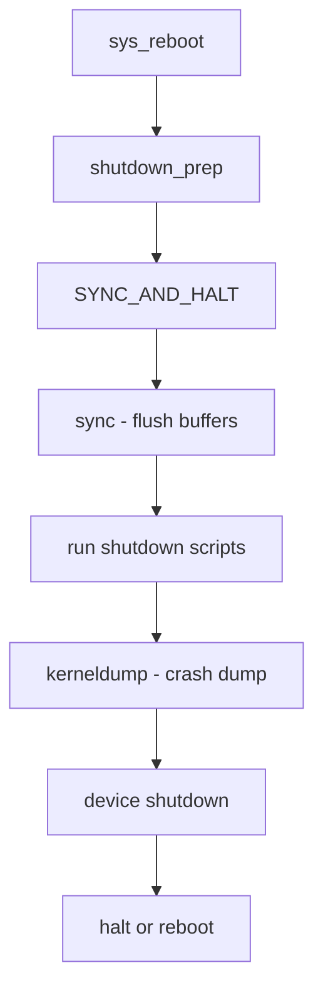

# Component: kern_shutdown.c

**Path:** `sys/kern/kern_shutdown.c`
**Type:** File
**Maps to:** `.discovery/sys/kern/kern_shutdown.md`

## Purpose

System shutdown and reboot - handles shutdown(8), reboot(2), and halt functionality. Coordinates graceful system shutdown including syncing filesystems, running shutdown scripts, and halting/rebooting the machine.

## Structure

## Key Functions

| Function | Purpose | Signature |
|----------|---------|-----------|
| `sys_reboot` | Reboot syscall | `int sys_reboot(struct thread *td, struct reboot_args *uap)` |
| `sys_shutdown` | Shutdown syscall | `int sys_shutdown(struct thread *td, struct shutdown_args *uap)` |
| `shutdown_nice` | Graceful shutdown | `void shutdown_nice(int howto)` |
| `boot` | Halt/reboot machine | `void boot(int howto)` |
| `reboot` | Actual reboot | `void reboot(int howto)` |
| `halt` | Halt CPU | `void halt(const char *howto)` |
| `sync` | Sync all filesystems | `void sync(struct thread *td)` |
| `reboot_kinfo` | Get reboot info | `int reboot_kinfo(struct thread *td, struct reboot_args *uap)` |

## Boot Flags (howto)

| Flag | Value | Description |
|------|-------|-------------|
| `RB_HALT` | 0x0001 | Halt, don't reboot |
| `RB_DUMP` | 0x0002 | Perform crash dump |
| `RB_SYNC` | 0x0004 | Sync before halt |
| `RB_SINGLE` | 0x0008 | Single user mode |
| `RB_KDB` | 0x0010 | Enter kernel debugger |
| `RB_REROOT` | 0x0020 | Reroot filesystem |
| `RB_POWEROFF` | 0x0040 | Power off machine |
| `RB_SERIAL` | 0x0080 | Use serial console |
| `RB_MULTIPLE` | 0x0100 | Multiple consoles |

## Shutdown Sequence

1. `shutdown_prep()` - prepare shutdown
2. `kerneldump()` - save crash dump if RB_DUMP
3. `sync()` - flush all filesystem buffers
4. `ffs_syncall()` - sync all UFS filesystems
5. `vfs_shutdown()` - unmount filesystems
6. `dev.shutdown()` - shutdown devices
7. `cpu_halt()` - stop all CPUs

## Includes

- `sys/reboot.h` - Reboot definitions
- `sys/eventhandler.h` - Shutdown handlers
- `sys/kernel.h` - Kernel subsystem

## Depends On

- `vfs_subr.c` for filesystem sync
- `kerneldump.c` for crash dumps
- Device drivers register shutdown handlers