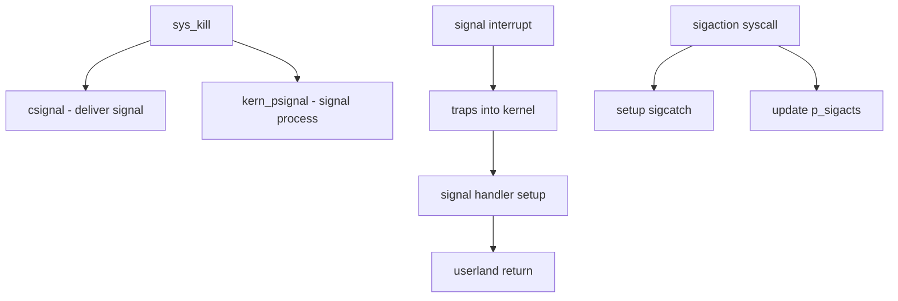

# Component: kern_sig.c

**Path:** `sys/kern/kern_sig.c`
**Type:** File
**Maps to:** `.discovery/sys/kern/kern_sig.md`

## Purpose

Signal handling - implements signal generation, delivery, and processing. Handles signal syscalls (kill, sigaction, sigprocmask, etc.) and the signal delivery mechanism to processes.

## Structure

## Key Functions

| Function | Purpose | Signature |
|----------|---------|-----------|
| `sys_kill` | Send signal to process | `int sys_kill(struct thread *td, struct kill_args *uap)` |
| `sys_sigaction` | Set signal handler | `int sys_sigaction(struct thread *td, struct sigaction_args *uap)` |
| `sys_sigprocmask` | Set signal mask | `int sys_sigprocmask(struct thread *td, struct sigprocmask_args *uap)` |
| `sys_sigsuspend` | Atomically set mask and wait | `int sys_sigsuspend(struct thread *td, struct sigsuspend_args *uap)` |
| `sys_sigreturn` | Return from signal handler | `int sys_sigreturn(struct thread *td, struct sigreturn_args *uap)` |
| `kern_psignal` | Signal a process | `void kern_psignal(struct proc *p, int sig)` |
| `csignal` | Send signal to process | `void csignal(struct proc *p, int sig, struct ucred *cred)` |
| `sigexit` | Process exiting from signal | `void sigexit(struct proc *p, int sig)` |
| `siginfo_to_user` | Deliver siginfo | `void siginfo_to_user(siginfo_t *si)` |

## Signal Types

| Category | Signals |
|----------|---------|
| Standard | SIGTERM, SIGINT, SIGKILL, SIGSTOP, etc. |
| Realtime | SIGRTMIN to SIGRTMAX |
| Coredump | SIGQUIT, SIGILL, SIGTRAP, etc. |

## Signal Actions

| Action | Description |
|--------|-------------|
| `SIG_DFL` | Default action |
| `SIG_IGN` | Ignore signal |
| Custom handler | User-defined function |

## Signal Mask

- Blocked signals during handler execution
- `sigprocmask()` to modify
- Inherited across fork()
- `sigsuspend()` for atomic swap

## Includes

- `sys/signalvar.h` - Signal definitions
- `sys/proc.h` - Process structures
- `sys/signal.h` - Signal numbers

## Depends On

- `kern_intr.c` for interrupt delivery
- `kern_trap.c` for signal on trap
- `execve` for signal delivery on exec