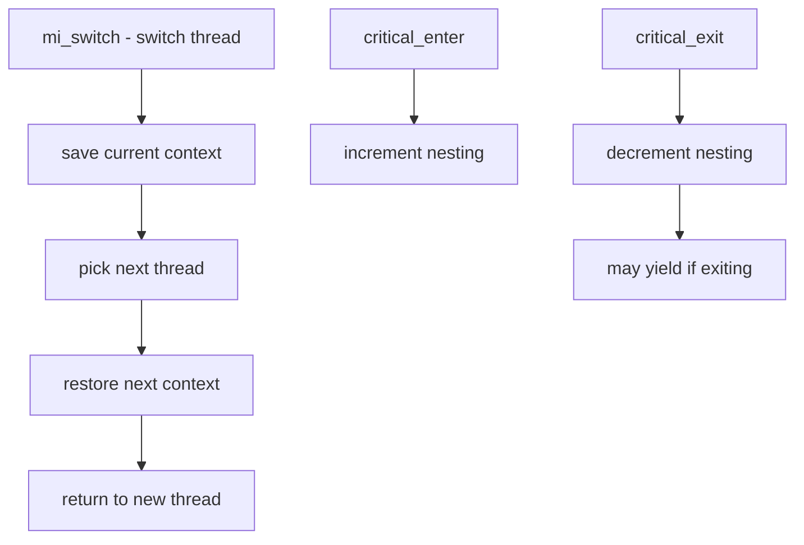

# Component: kern_switch.c

**Path:** `sys/kern/kern_switch.c`
**Type:** File
**Maps to:** `.discovery/sys/kern/kern_switch.md`

## Purpose

Context switching - implements core thread context switching. Handles switching between threads, critical sections, and preemption management.

## Structure

## Key Functions

| Function | Purpose | Signature |
|----------|---------|-----------|
| `mi_switch` | Main switch | `void mi_switch(int flags, struct thread *newtd)` |
| `critical_enter` | Enter critical | `void critical_enter(void)` |
| `critical_exit` | Exit critical | `void critical_exit(void)` |
| ` preempt` | Preemption | `void preempt(void)` |
| `sched_switch` | Schedule switch | `void sched_switch(struct thread *td, ...)` |

## Switch Flags

| Flag | Description |
|------|-------------|
| `SW_INVOL` | Involuntary switch |
| `SW_VOL` | Voluntary switch |
| `SW_PREPT` | Preempted |

## Critical Sections

| Level | Description |
|-------|-------------|
| `0` | Normal |
| `>0` | In critical |

## Thread States

| State | Description |
|-------|-------------|
| `TD_RUNNING` | Currently running |
| `TD_RUNNABLE` | Ready to run |
| `TD_SLEEPING` | Sleeping |
| `TD_STOPPED` | Stopped |

## Preemption

| Feature | Description |
|---------|-------------|
| `FULL_PREEMPTION` | Full preemption |
| `PREEMPTION` | Kernel preemption |

## KTR Sections

| Section | Description |
|---------|-------------|
| `KTR_SCHED` | Scheduling events |
| `KTR_CRITICAL` | Critical sections |

## Includes

- `sys/sched.h` for scheduler
- `machine/cpu.h` for CPU

## Depends On

- `kern_sched.c` for scheduling
- `machine/switch.h` for MD switch