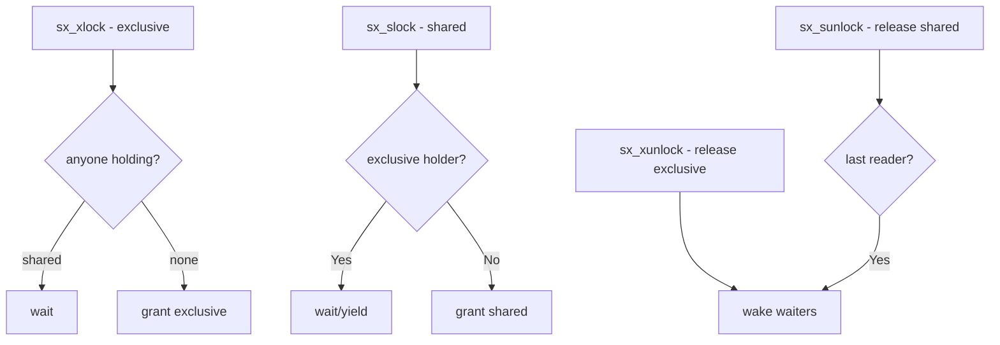

# Component: kern_sx.c

**Path:** `sys/kern/kern_sx.c`
**Type:** File
**Maps to:** `.discovery/sys/kern/kern_sx.md`

## Purpose

Shared/exclusive locks (sx) - implements sx locks allowing multiple shared holders or one exclusive holder. Used extensively in VFS and other subsystems.

## Structure



## Key Functions

| Function | Purpose | Signature |
|----------|---------|-----------|
| `sx_xlock` | Acquire exclusive | `void sx_xlock(struct sx *sx)` |
| `sx_xunlock` | Release exclusive | `void sx_xunlock(struct sx *sx)` |
| `sx_slock` | Acquire shared | `void sx_slock(struct sx *sx)` |
| `sx_sunlock` | Release shared | `void sx_sunlock(struct sx *sx)` |
| `sx_init` | Initialize | `void sx_init(struct sx *sx, const char *description)` |
| `sx_destroy` | Destroy | `void sx_destroy(struct sx *sx)` |

## SX Flags

| Flag | Description |
|------|-------------|
| `SX_DUPOK` | Allow duplicates |
| `SX_NOWITNESS` | No witness |
| `SX_RECUURSIVE` | Allow recursive |

## SX Structure

```c
struct sx {
    struct lock_object lock_object;  // Base
    uintptr_t sx_lock;              // Lock word
    const char *sx_name;            // Name
};
```

## Lock Word

| Value | Meaning |
|-------|---------|
| `0` | Unlocked |
| `XLOCKED` | Exclusive |
| `> 0` | Shared count |

## Uses

| Use | Description |
|-----|-------------|
| `VFS` | Filesystem locks |
| `vnode` | Vnode locks |
| `ZFS` | ZFS operations |

## Includes

- `sys/sx.h` - SX lock definitions

## Depends On

- `sys/sleepqueue.h` for sleeping
- `sys/lock.h` for lock protocol