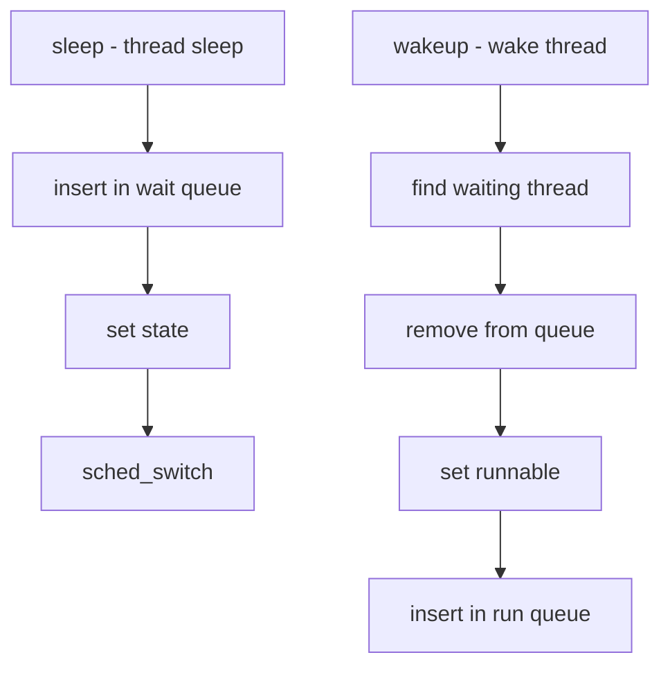

# Component: kern_synch.c

**Path:** `sys/kern/kern_synch.c`
**Type:** File
**Maps to:** `.discovery/sys/kern/kern_synch.md`

## Purpose

Synchronization primitives - implements sleep/wakeup, turnstiles, and thread scheduling. Core of kernel synchronization and context switching.

## Structure

## Key Functions

| Function | Purpose | Signature |
|----------|---------|-----------|
| `sleep` | Sleep on address | `int sleep(void *chan, int priority)` |
| `wakeup` | Wake one | `void wakeup(void *chan)` |
| `wakeup_one` | Wake one | `void wakeup_one(void *chan)` |
| `wakeup_all` | Wake all | `void wakeup_all(void *chan, int priority)` |
| `tsleep` | Sleep with timeout | `int tsleep(void *chan, int priority, const char *wmesg, int timo)` |
| `msleep` | Sleep milliseconds | `int msleep(void *chan, struct mtx *mtx, int priority, const char *wmesg, int timo)` |
| `ssleep` | Sleep seconds | `int ssleep(void *chan, struct mtx *mtx, int priority, int sec)` |
| `pause` | Sleep with timeout | `void pause(const char *wmesg, int timo)` |

## Turnstile Operations

| Function | Purpose |
|----------|---------|
| `turnstile_init` | Initialize turnstile |
| `turnstile_wait` | Wait on turnstile |
| `turnstile_wakeup` | Wake turnstile waiters |

## Wait Channels

- Used for kernel synchronization
- Generic address-based sleeping
- `wakeup()` broadcasts to all on channel

## Includes

- `sys/proc.h` - Process/thread
- `sys/sched.h` - Scheduler
- `sys/sleepq.h` - Sleep queues

## Depends On

- `kern_sched.c` for scheduling
- `kern_mutex.c` for lock integration