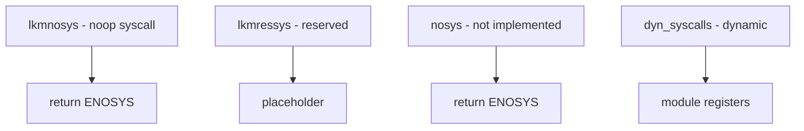

# Component: kern_syscalls.c

**Path:** `sys/kern/kern_syscalls.c`
**Type:** File
**Maps to:** `.discovery/sys/kern/kern_syscalls.md`

## Purpose

System call support - provides loadable module syscall stubs. Contains placeholder syscalls for dynamically loadable syscall numbers.

## Structure



## Key Functions

| Function | Purpose | Signature |
|----------|---------|-----------|
| `lkmnosys` | LKM no-syscall | `int lkmnosys(struct thread *td, struct nosys_args *args)` |
| `lkmressys` | LKM reserved | `int lkmressys(struct thread *td, struct nosys_args *args)` |
| `nosys` | Not implemented | `int nosys(struct thread *td, struct nosys_args *args)` |
| `kern_nosys` | Kern nosys | `int kern_nosys(struct thread *td, int code)` |

## System Call Entry

```c
struct sysent {
    int sy_narg;                    // Arg count
    struct sysent_args *sy_argsys;  // Arg descriptors
    sy_call_t *sy_call;           // Function
    sy_return_t *sy_return;        // Return handler
    int sy_flags;                  // Flags
};
```

## Syscall Slots

| Type | Description |
|------|-------------|
| `nosys` | Unused slot |
| `lkmnosys` | LKM reserved |
| `lkmressys` | Reserved for LKM |

## Dynamic Syscalls

| Feature | Description |
|---------|-------------|
| `mod_load` | Load syscall module |
| `mod_unload` | Unload module |

## Nosys Return

| Error | Description |
|-------|-------------|
| `ENOSYS` | Syscall not implemented |

## Includes

- `sys/sysent.h` - Syscall entry

## Depends On

- `sys/syscall.h` for syscall numbers