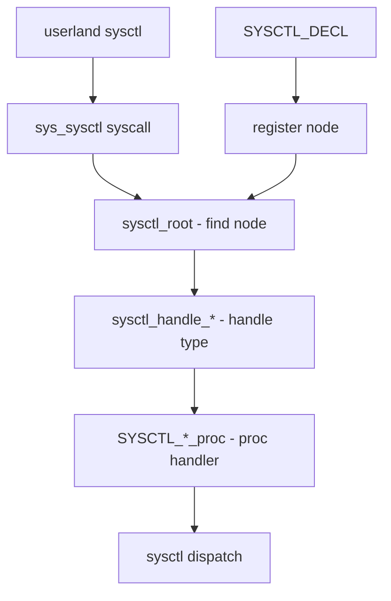

# Component: kern_sysctl.c

**Path:** `sys/kern/kern_sysctl.c`
**Type:** File
**Maps to:** `.discovery/sys/kern/kern_sysctl.md`

## Purpose

Sysctl subsystem - implements the sysctl(8) system call and management interface for kernel tunable parameters. Provides runtime configuration and statistics through a hierarchical MIB tree.

## Structure



## Sysctl Node Hierarchy

```
kern/
├── hw/
├── vm/
├── vfs/
├── net/
├── debug/
├── security/
├── machdep/
└── user/
```

## Key Functions

| Function | Purpose | Signature |
|----------|---------|-----------|
| `sys_sysctl` | Main syscall | `int sys_sysctl(struct thread *td, struct sysctl_args *uap)` |
| `sysctl_root` | Find root node | `int sysctl_root(struct thread *td, struct sysctl_req *req)` |
| `sysctl_handle_int` | Integer handler | `int sysctl_handle_int(...)` |
| `sysctl_handle_string` | String handler | `int sysctl_handle_string(...)` |
| `sysctl_handle_opaque` | Opaque data handler | `int sysctl_handle_opaque(...)` |
| `sysctl_register` | Register MIB entry | `void sysctl_register(...)` |
| `sysctl_register_oid` | Register with full options | `void sysctl_register_oid(...)` |
| `sysctl_add_oid` | Dynamic OID addition | `struct sysctl_oid *sysctl_add_oid(...)` |

## Sysctl Macros

| Macro | Purpose |
|-------|---------|
| `SYSCTL_DECL(name)` | Begin sysctl scope |
| `SYSCTL_INT(parent, oid, name, ...)` | Integer leaf |
| `SYSCTL_STRING(parent, oid, name, ...)` | String leaf |
| `SYSCTL_PROC(parent, oid, name, ...)` | Procedure leaf |
| `SYSCTL_NODE(parent, oid, name, ...)` | Intermediate node |
| `SYSCTL_U64(parent, oid, name, ...)` | Unsigned 64-bit |

## Handler Types

| Type | Sysctl Handler |
|------|----------------|
| `CTLTYPE_INT` | `sysctl_handle_int` |
| `CTLTYPE_STRING` | `sysctl_handle_string` |
| `CTLTYPE_OPAQUE` | `sysctl_handle_opaque` |
| `CTLTYPE_NODE` | `sysctl_root` |
| `CTLTYPE_QUAD` | `sysctl_handle_64` |

## Includes

- `sys/sysctl.h` - Sysctl definitions
- `sys/proc.h` - Process structures
- `sys/malloc.h` - Memory allocation

## Depends On

- All kernel subsystems register via this API
- `sysctl.conf` for startup configuration
- Used by `sysctl` command in userland