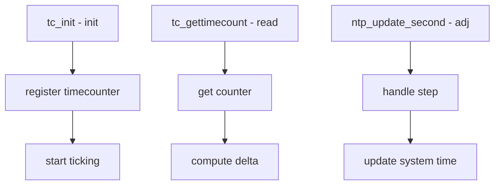

# Component: kern_tc.c

**Path:** `sys/kern/kern_tc.c`
**Type:** File
**Maps to:** `.discovery/sys/kern/kern_tc.md`

## Purpose

Timecounter - implements hardware timecounter reading and time conversion. Reads hardware counters and converts to system time for timekeeping.

## Structure



## Key Functions

| Function | Purpose | Signature |
|----------|---------|-----------|
| `tc_init` | Initialize | `void tc_init(struct timecounter *tc)` |
| `tc_gettimecount` | Read counter | `u_int tc_gettimecount(struct timecounter *tc)` |
| `tc_adjbtime` | Adjust boottime | `void tc_adjbtime(struct bintime *bt)` |
| `tc_windup` | Advance time | `void tc_windup(void)` |

## Timecounter Structure

```c
struct timecounter {
    u_int (*tc_get_timecount)(struct timecounter *tc);
    void (*tc_poll)(struct timecounter *tc);
    uint64_t tc_frequency;       // Hz
    const char *tc_name;         // Name
    int tc_quality;             // Quality
    int tc_flags;
    void *tc_priv;              // Private
};
```

## Timecounter Methods

| Method | Description |
|--------|-------------|
| `tc_get_timecount` | Read counter |
| `tc_poll` | Poll for events |
| `tc_adj_time` | Adjust time |

## Dummy Timecounter

| Use | Description |
|-----|-------------|
| `dummy_get_timecount` | Early boot |
| `DELAY` | Pre-scheduler |

## Time Conversion

| Function | Description |
|----------|-------------|
| `tc_to_timeval` | To timeval |
| `tc_to_timespec` | To timespec |
| `tc_to_bintime` | To bintime |

## Timecounter Selection

| Factor | Description |
|--------|-------------|
| `tc_quality` | Higher = preferred |
| `tc_frequency` | Counter speed |

## Sysctl

| Node | Description |
|------|-------------|
| `kern.timecounter` | Timecounter settings |

## Includes

- `sys/timetc.h` - Timecounter definitions

## Depends On

- `kern_clocksource.c` for clock sources